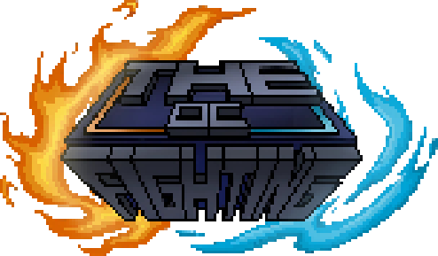

## The OC Fighting

   

## About This Project
_WIP_

## Links
_WIP_

## Roadmap
_WIP_

## Members

| Member            | Role                     |
|-------------------|--------------------------|
| [@Forgeey](https://b23.tv/1Mjs3qK)          | Project Lead & Art Director   |
| [@OakPlatinum](https://github.com/OakPlatinum)      | Tech Lead & Developer    |
| @12.1Ounce        | Scenario Designer        |
| @瑞雯              | Narrative Designer       |
| @Furai            | Developer                | 

> **Want to see your name?** Comment on the pinned **#team-recruitment** discussion!

## Bug Report / Suggestion
We welcome community contributions and value your voice!

### 🐛 **Issues**  
Use Issues to report bugs or propose enhancements:  

**Bug Reports**  
- Check existing issues first to avoid duplicates  
- Use our Bug Report Template and include:  
  - Clear descriptive title  
  - Environment (OS, browser/device, package versions)  
  - Step-by-step reproduction guide  
  - Expected vs. actual behavior  
  - Relevant logs/screenshots  

**Feature Requests**  
- Start the title with "[Feature]"  
- Clearly describe:  
  - Problem/value proposition  
  - Proposed solution (optional)  
  - Alternatives considered  

### 💬 **Discussions**  
Join Discussions for open-ended conversations:  

**Categories**  
- 💡 **Ideas**: Brainstorm proposals before formal feature requests  
- ❓ **Q&A**: Ask questions & share knowledge  
- 🎨 **Showcase**: Share projects built with this repo  
- 📢 **Announcements** (maintainer-only): Major updates  

**Guidelines**  
1. Search before creating new topics  
2. Keep conversations focused - split tangential topics  
3. Use reactions (👍/👎) to indicate agreement 

## License
The software code contained herein is licensed under the MIT License. Notwithstanding the foregoing, all materials residing within the `assets` subdirectory and its progeny directories - including, but not limited to, design schematics, conceptual frameworks, graphical assets, audiovisual works, and derivative creations - remain expressly excluded from said license and are protected under intellectual property laws.

Copyright © 2025 Forgeey. All rights reserved. Unauthorized use or duplication of this material without express written permission is prohibited.

Unauthorized reproduction, distribution, or exhibition of protected materials, whether in whole or in part, through any medium now known or hereafter devised, without prior written consent from the copyright holder is expressly prohibited. This prohibition extends to, but is not limited to, digital replication, physical reproduction, transformative adaptation, and public dissemination. This notice shall be governed by and construed in accordance with the laws of Shanghai, China.
