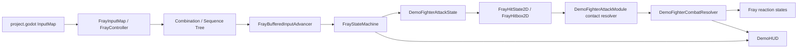
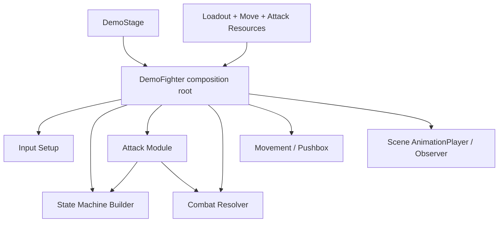
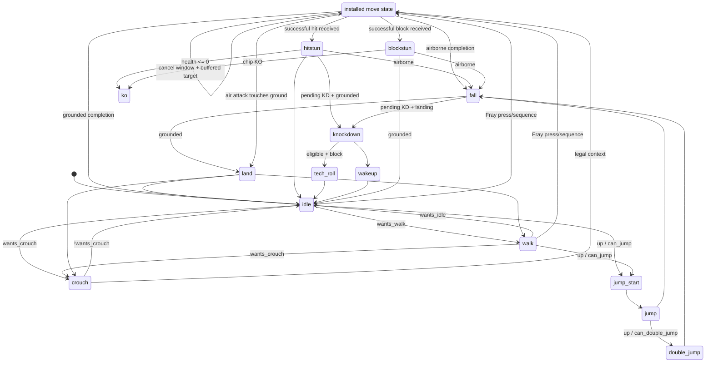

# Demo 架构说明

本文描述 **2026-07-31 工作区中的实际实现**。历史上出现过的 F1 配置菜单、自定义键位、运行时招式安装/卸载、指令录制和配置存档已经回退，不属于当前 demo。

## 目录与边界

- `addons/fray/src/`：Fray 核心输入、状态机、hitbox 和动画观察能力。
- `scenes/`：默认场景、训练舞台、HUD、fighter、固定 melee hit-state 和投射物场景。
- `scripts/stage/core/`：舞台流程与角色生成；`scripts/stage/ui/`：HUD 和招式表展示。
- `scripts/fighter/`：按 `core`、`combat`、`input`、`movement`、`moves`、`state_machine` 拆分的角色装配与薄业务组件；视觉动画直接保存在 fighter 场景的 `AnimationPlayer` 轨道中。
- `scripts/fighter/state_machine/states/`：按 `locomotion`、`combat`、`reaction` 分类的 gameplay 状态，均继承 `FrayState`。
- `scripts/resources/`：按 `fighter`、`moves`、`combat` 分类的 loadout、move、command、环境和 projectile attribute 类型。
- `resources/`：实际攻击、招式、固定 loadout 和环境资源。

默认入口为：

```text
res://scenes/fray_fighter_demo.tscn
```

## 总体运行链路





1. `demo_stage.gd` 创建玩家和对手、建立双方引用并连接 HUD。
2. 当前 stage 明确关闭 `opponent.ai_enabled`，因此对手是静止 dummy；`DemoFighterVirtualAI` 只是保留的可选组件。
3. `DemoFighter` 从固定 `DemoFighterLoadout` 缓存 fighter 场景中已存在的 `FrayHitState2D`，再建立 Fray 输入和状态机。
4. `project.godot` 的 `p1_*` InputMap action 进入 `FrayInputMap` 和 `FrayController`。
5. 朝向输入、组合输入和动作序列由 Fray input API 表达，再由 `FrayBufferedInputAdvancer` 提供给 Fray transition。
6. `DemoFighterStateMachineBuilder` 注册状态、tag、rule、condition 和 transition。
7. 攻击状态按 `FrayAttackAttribute` 的整数 gameplay frame 推进 hitbox、取消窗口、位移和 projectile 生成。
8. melee 与 projectile 接触都进入 `DemoFighterAttackModule.try_resolve_contact()`。
9. `DemoFighterCombatResolver.receive_hit()` 根据同一个 `FrayAttackAttribute` 结算格挡、伤害、连段缩放、juggle、硬直、倒地、hitstop 和 KO。

## Fray-first 状态机

`demo_fighter_state_machine_builder.gd` 使用 `FrayCompoundState.builder()` 构建拓扑。主要状态包括：

- neutral：`idle`、`walk`、`crouch`
- movement：`dash_forward`、`dash_back`、`jump_start`、`jump`、`double_jump`、`fall`、`land`
- attacks：每个已安装 `DemoMoveDefinition` 对应一个 `DemoFighterAttackState`
- reactions：`hitstun`、`blockstun`、`knockdown`、`wakeup`、`tech_roll`、`ko`

输入转移使用 Fray press/sequence transition；组合技取消使用 `FrayBufferedInputAdvancer`、condition 和 `SwitchMode.IMMEDIATE`。外部命中事件只在集中战斗结算处调用 `FrayStateMachine.goto()`，没有另建 enum/string 状态分发器。



### 空中攻击落地

带 `air_attack` tag 的攻击具有两条完成路径：

- 一旦 `!is_airborne`，通过 immediate auto transition 进入 `land`。
- 如果攻击按 `duration_frames` 在空中完成，则按正常 AT_END transition 进入 `fall`。

空中攻击不再拥有直接进入 `idle` 的完成路径，因此接地时会统一清理攻击框、恢复站立/蹲伏 hurtbox、解除空中锁并执行 landing recovery。

## 攻击时序与动画

`demo_fighter_attack_state.gd` 的逻辑时序只读取 `FrayAttackAttribute`：

- `startup_frames`
- `active_frames`
- `cancel_start_frame` / `cancel_end_frame`
- `duration_frames`
- 攻击位移和 projectile 参数（扩展 attribute）

`attack_frame` 每个有效 physics gameplay tick 增加一次。攻击状态仅在 attribute 缺失、fighter 缺失或 `attack_frame >= duration_frames` 时完成。

`AnimationPlayer` 仍播放对应视觉动画，但攻击状态不监听动画结束信号，也不会让动画资源长度改变 hitbox 或取消窗口。`FrayAnimationObserver` 仍用于 `land` 等确实需要观察一次性视觉恢复的状态。

## 输入和暂停感知缓冲时钟

`FrayBufferedInputAdvancer` 现在把两个概念分开：

- `paused`：是否把已缓冲输入喂给状态机。
- `buffer_clock_paused`：是否推进用于 timestamp、buffer age 和 accepted-input interval 的 gameplay clock。

该 clock 由 advancer 选定的 idle/physics `delta` 推进，而不是用 `Time.get_ticks_msec()` 计算老化。

`DemoFighter._sync_input_advancer_pause()` 在 hitstop 时同时暂停消费和 buffer clock；在普通攻击等暂时不允许消费输入的状态中，只暂停消费，clock 仍正常推进。这样：

- hitstop 期间仍能收集输入；
- hitstop 期间新旧输入都不会老化；
- 恢复后输入继续按 gameplay 时间老化；
- `DemoFighterComboInput` 的 cancel-window 起点与 buffered input timestamp 使用同一时钟。

Fray sequence matcher 仍负责 command 识别；demo 没有引入第二套输入缓存。

## 攻击数据唯一来源

`FrayAttackAttribute` 是攻击与受击反应数据的唯一来源：

- 固定 melee 招式：resource 挂在 fighter 场景已实例化 hit-state 的 strike `FrayHitbox2D.attribute` 上。
- projectile：节点层级和 `FrayHitbox2D` 固定在独立 `.tscn` 中，生成实例时只把同一个 projectile attribute 应用到已有 hitbox。
- `DemoFighterAttackModule` 只查找并缓存场景中的 hit-state、strike 和 projectile attribute，不再安装或移除 provider。
- `DemoFighterCombatResolver` 接收完整 attribute，不接收重复的 damage、hitstun、knockback 等散装参数。

`DemoProjectileAttackAttribute` 只扩展 projectile 特有的速度、寿命、尺寸和缩放，仍保持 Fray-compatible attribute/resource 模型。

## 统一接触结算

`DemoFighterAttackModule.try_resolve_contact()` 是 melee 和 projectile 共用的接触入口，负责：

1. 检查 attacker、detector、detected hitbox。
2. 排除自身和非 `DemoFighter` source。
3. 查询单次 active window / projectile 的目标缓存。
4. 从 `detector_hitbox.attribute` 读取 `FrayAttackAttribute`。
5. 调用 `target.receive_hit(attacker, attack)`。
6. **仅在返回 `true` 后**把 target 写入缓存并报告成功。

因此 knockdown/recovery 无敌、KO、juggle limit 等拒绝不会被误记为已命中。Projectile 也只在 helper 返回成功后 `queue_free()`，失败接触可以在后续 physics tick 重新尝试。

## Fray hit-state 信号边界

`DemoFighterAttackModule` 只连接一次 `FrayHitStateManager2D.hitbox_intersected`。Manager 本身负责连接 child `FrayHitState2D` 并重发事件，因此 demo 不再同时直接连接每个 child signal，避免同一接触进入两次结算链路。

固定 melee active window 开启时仍会主动查询当前 overlap。原因是 `FrayHitbox2D` 的 entered signal 是边沿触发：若 hitbox 激活前已经与 hurtbox 重叠，不保证产生新的 entered 事件。查询结果仍先经过 `detector.can_detect()`，最后进入攻击模块的统一接触方法。

## 战斗结算

`demo_fighter_combat_resolver.gd` 集中处理：

- guard type 与空防规则
- chip damage 与 chip KO
- combo damage/hitstun scaling
- juggle point 限制
- knockback、launch、knockdown、wakeup
- attacker/defender hitstop 或 blockstop
- `hitstun`、`blockstun`、`knockdown`、`ko` 的集中 `goto()`

`receive_hit()` 返回布尔值。该返回值是攻击模块判断“本次接触是否真正被结算”的唯一依据。

## 主要组件职责

| 文件 | 职责 |
|---|---|
| `demo_fighter.gd` | 角色门面、组件装配、状态查询、gameplay-frame hitstop 计数与暂停同步 |
| `demo_fighter_input_setup.gd` | 固定 InputMap 到 Fray 的桥接、朝向组合和 sequence tree |
| `demo_fighter_state_machine_builder.gd` | Fray 状态拓扑、tag、rule、condition、transition |
| `demo_fighter_combo_input.gd` | 基于 advancer buffer 的取消匹配和精确消费 |
| `demo_fighter_attack_module.gd` | 静态 hit-state 查找、真实 attribute 索引、Fray hit state 激活、即时 overlap、统一接触过滤与目标缓存 |
| `demo_fighter_combat_resolver.gd` | guard、伤害、双人对战 combo session、缩放、juggle、反应、hitstop、KO |
| `demo_fighter_projectile.gd` | 配置静态投射物场景中的 Fray hitbox，并负责移动、寿命和接触 |
| `demo_fighter_movement.gd` | 地面/空中移动、重力、攻击位移 |
| `demo_fighter_pushbox.gd` | 角色互推、墙角剩余位移分配与角色原点舞台边界 |

## Pushbox 约束与结算

`DemoFighterPushbox` 是固定 fighter 场景的一部分，不作为可缺失的可选组件处理。`setup()` 和首次使用通过断言验证以下约束：

- 必须绑定有效的 `DemoFighter`，且场地左边界小于右边界。
- Pushbox 节点必须配置 `RectangleShape2D`。
- 对手必须存在独立的 `DemoFighterPushbox`，不能把自身设置为对手。
- 姿态名称仅允许 `Stand`、`Crouch` 和 `Air`。

初始化时会复制场景中的 `RectangleShape2D`，避免两个 fighter 实例共享 Shape2D 资源并在切换姿态时互相修改尺寸。固定场景约束不再通过每个物理帧的空值回退或临时创建默认形状掩盖，错误配置应在开发阶段立即暴露。

互推只计算两个世界坐标轴对齐矩形的水平重叠：

1. 正常情况下双方各承担一半分离距离。
2. 一方受舞台边界限制时，未完成的剩余距离交给另一方。
3. 双方 X 坐标完全相同时，使用 instance ID 稳定决定相反推挤方向，避免零方向导致永久重叠。
4. `SEPARATION_MARGIN` 用于消除浮点边界上的立即再重叠。

当前 `arena_left` / `arena_right` 约束的是 fighter 原点，不是 pushbox 外沿；文档和关卡参数均按角色原点边界理解。

## 当前明确不包含的系统

以下内容不是隐藏入口，也不是“已完成但关闭”的正式功能：

- F1 配置菜单
- 可重绑控制
- runtime 招式安装/卸载
- command 录制器
- versioned 配置存档
- 已启用的 CPU 自动格挡/对战行为
- round/match flow
- 完整 training dummy 设置
- 完整 throw / throw-tech 流程

其中 `DemoFighterVirtualAI` 和 throw contact signal 只保留扩展接口；默认 stage 不启用 AI，throw 也没有游戏级演出和双方状态流程。

## 验证重点

除基础移动、指令、组合技和格挡外，修改输入、状态机、hitbox 或动画时重点检查：

1. 空中攻击接地立即进入 `land`，空中结束才进入 `fall`。
2. 攻击动画长短不改变 `duration_frames`、active/cancel window。
3. hitstop 内 buffered input 不老化，普通攻击期间 buffer 仍按 gameplay clock 老化。
4. manager signal 每次接触只进入一次统一 helper。
5. 失败的 `receive_hit()` 不消费 melee target，也不销毁 projectile。
6. 成功 projectile 接触只结算一次并销毁实例。
