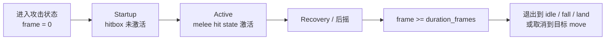
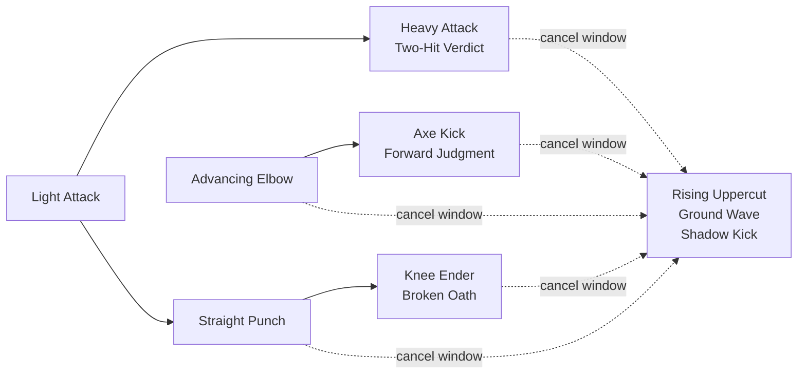
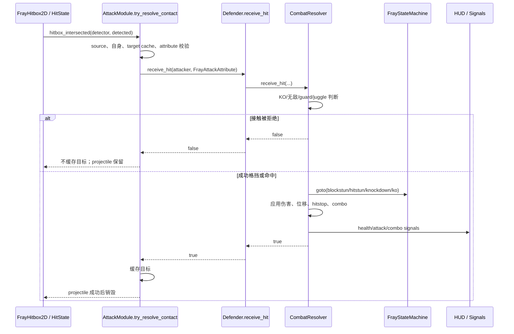
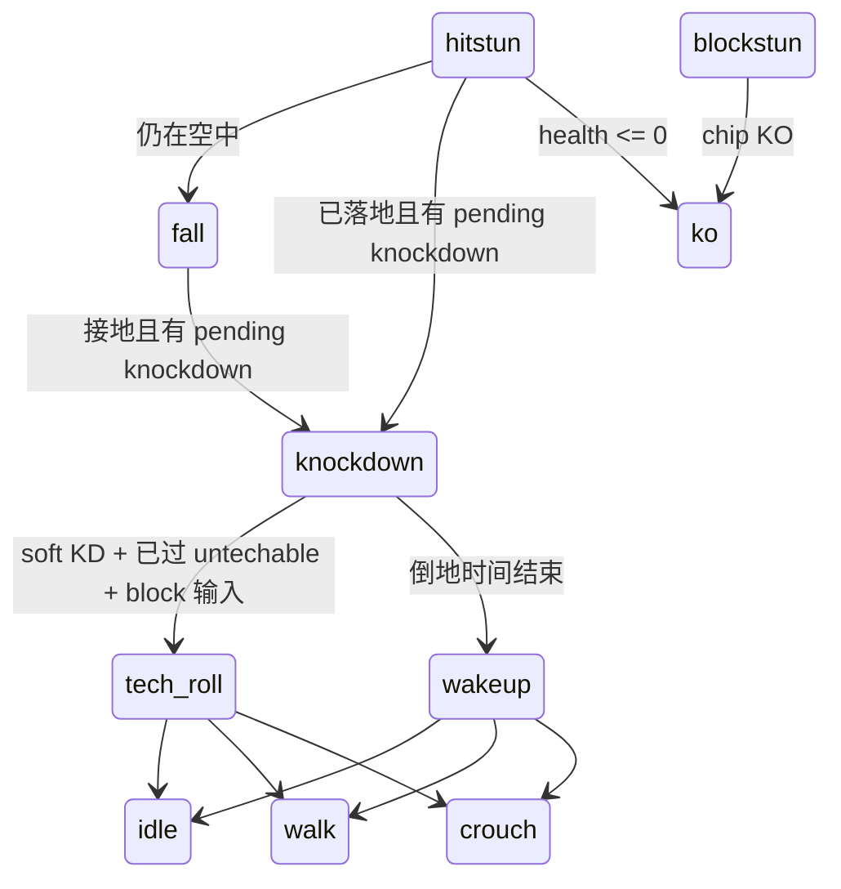

# 战斗设计与数值规格

> 本文是策划与开发可读的战斗规格快照。可执行真值始终位于 `resources/attacks/*.tres` 的 `FrayAttackAttribute`；修改数值时必须先改资源，再同步本文。

## 1. 逻辑帧与时序

项目 physics tick 为 **34 Hz**，一个 gameplay frame 等于一个 physics tick：

```text
秒数 = gameplay_frames / 34
```

攻击状态的单一时间轴：



- melee active window：`startup_frames <= frame < startup_frames + active_frames`。
- cancel window：`cancel_start_frame <= frame <= cancel_end_frame`。
- total duration：`duration_frames`。
- projectile move 在 `frame >= startup_frames` 时生成 projectile；Ground Wave 的 `active_frames = 0`，碰撞生命周期由 projectile attribute 管理。
- 动画长度不参与以上计算。

## 2. 指令与招式目录

### Neutral 可用招式

| 招式 | 上下文 | Fray 指令 | 面向右默认键位 |
|---|---|---|---|
| Light Attack | 地面 | `light` | `J` |
| Heavy Attack | 地面 | `heavy` | `K` |
| Special Attack | 地面 | `special` | `L` |
| Sweep Attack | 蹲姿 | `down + heavy` | `S + K` |
| Launcher | 蹲姿 | `down + special` | `S + L` |
| Air Light / Heavy / Special | 空中 | 对应攻击输入 | `J` / `K` / `L` |
| Advancing Elbow | 地面 | `forward + light` | `D + J` |
| Rising Uppercut | 地面 | `forward -> down -> down + forward + light` | `D -> S -> S + D + J` |
| Ground Wave | 地面 | `down -> down + forward -> forward + special` | `S -> S + D -> D + L` |
| Shadow Kick | 地面 | `back -> forward + heavy` | `A -> D + K` |

### 组合路线与取消



- `Heavy Attack`、`Knee Ender`、`Axe Kick` 是招式表中显示的组合终结段。
- `Straight Punch`、`Knee Ender`、`Axe Kick` 的 `neutral_available = false`，只能通过合法取消路径进入。
- `Light Attack` 可取消到 Heavy 或 Straight Punch。
- 组合段和终结段的特殊技取消目标来自 move resource 的 `cancel_target_move_ids`。

## 3. 攻击数值表

Guard：M = Mid，L = Low，O = Overhead。KD：— = 无，S = Soft，H = Hard。取消 `—` 表示无脚本取消窗口。

| Move ID | Guard | Total | Start | Active | Cancel | Dmg / Chip | Hit / Block stun | Hit / Block stop | Juggle start/inc/limit | KD | KB | Launch Y |
|---|---:|---:|---:|---:|---:|---:|---:|---:|---:|---:|---:|---:|
| `light_attack` | M | 24 | 3 | 4 | 11–18 | 7 / 1 | 15 / 9 | 4 / 2 | 0 / 1 / 5 | — | 210 | 0 |
| `heavy_attack` | M | 31 | 5 | 4 | 10–21 | 13 / 3 | 20 / 11 | 4 / 2 | 0 / 2 / 6 | — | 300 | 0 |
| `special_attack` | O | 31 | 7 | 7 | — | 20 / 5 | 19 / 10 | 4 / 2 | 1 / 2 / 6 | — | 420 | -160 |
| `sweep_attack` | L | 28 | 6 | 5 | — | 10 / 2 | 13 / 8 | 4 / 2 | 0 / 2 / 5 | S 26f | 260 | 0 |
| `launcher_attack` | M | 34 | 8 | 5 | — | 14 / 4 | 18 / 10 | 4 / 2 | 1 / 1 / 6 | S 24f | 250 | -520 |
| `air_light_attack` | O | 20 | 4 | 5 | — | 6 / 1 | 10 / 6 | 4 / 2 | 0 / 1 / 5 | — | 190 | 0 |
| `air_heavy_attack` | O | 30 | 6 | 6 | — | 12 / 3 | 14 / 8 | 4 / 2 | 0 / 2 / 6 | — | 300 | 0 |
| `air_special_attack` | O | 34 | 7 | 7 | — | 15 / 4 | 16 / 9 | 4 / 2 | 0 / 3 / 7 | S 22f | 330 | -220 |
| `straight_punch` | M | 22 | 3 | 3 | 8–17 | 6 / 1 | 15 / 9 | 3 / 2 | 0 / 1 / 5 | — | 165 | 0 |
| `knee_ender` | M | 28 | 5 | 4 | 10–21 | 11 / 3 | 19 / 11 | 4 / 2 | 0 / 2 / 6 | — | 285 | 0 |
| `front_elbow` | M | 25 | 5 | 4 | 10–19 | 9 / 2 | 19 / 10 | 4 / 2 | 0 / 1 / 5 | — | 220 | 0 |
| `axe_kick` | O | 31 | 7 | 4 | 12–23 | 13 / 4 | 21 / 12 | 5 / 2 | 0 / 2 / 6 | — | 335 | 0 |
| `rising_uppercut` | M | 38 | 4 | 7 | — | 18 / 5 | 20 / 11 | 4 / 2 | 2 / 3 / 7 | H 34f | 380 | -430 |
| `ground_wave` | M | 32 | 9 | 0 | — | 16 / 4 | 17 / 12 | 4 / 2 | 0 / 2 / 6 | — | 360 | 0 |
| `shadow_kick` | M | 34 | 7 | 5 | — | 18 / 4 | 22 / 13 | 6 / 2 | 0 / 2 / 7 | S 30f | 440 | 0 |

### Projectile 专属参数

| Move | 速度 | 寿命 | 出生偏移 | hitbox 尺寸 | 视觉缩放 |
|---|---:|---:|---:|---:|---:|
| Ground Wave | 560 px/s | 1.35 s | `(78, -34)`，X 随朝向镜像 | `(82, 36)` | `(0.42, 0.42)` |

## 4. 格挡规则

| 攻击类型 | 站立防御 | 蹲伏防御 | 空中防御 |
|---|---:|---:|---:|
| Mid | 可 | 可 | `can_air_block` 为 true 时可 |
| Low | 不可 | 可 | 由 air-block 条件决定；当前没有 airborne low move |
| Overhead | 可 | 不可 | `can_air_block` 为 true 时可 |
| Throw | 不可 | 不可 | 不可；当前仅发出接口 signal |
| Unblockable | 不可 | 不可 | 不可 |

其他约束：

- 地面角色仅在 neutral 或持续中的 `blockstun` 可建立防御。
- 空中角色必须有 `airborne` tag，或已经处于 `blockstun`。
- 格挡伤害使用 `block_damage`，可把生命降到 0 并进入 `ko`。
- 格挡水平击退为攻击 `knockback × 0.42`。

## 5. 命中、连段与 juggle

### 伤害缩放

第 `n` 次命中前，`hit_count = n - 1`：

```text
damage_scale = max(0.30, 0.90 ^ hit_count × combo_initial_scale)
scaled_damage = round(base_damage × damage_scale)
```

- 正伤害至少造成 1 点。
- `Ground Wave.combo_initial_scale = 0.9`；其他当前招式默认 1.0。
- combo 在防守方回到 `idle`、`walk` 或 `crouch` 时清空。

### 空中硬直衰减

```text
air_hitstun_scale = air_hitstun_decay ^ (air_hit_count - 1)
air_hitstun_frames = max(4, round(base_hitstun × air_hitstun_scale))
```

### Juggle 接受条件

```text
current_juggle_points + attack.juggle_increment <= attack.juggle_limit
```

- 地面目标被 launch 时，用 `juggle_start` 初始化 juggle points。
- 已在空中的目标每次成功受击增加 `juggle_increment`。
- 超过 `juggle_limit` 时 `receive_hit()` 返回 false；接触不能被消费，projectile 也不能因此销毁。

## 6. 接触结算顺序



## 7. 倒地、恢复与 KO



- Hard knockdown 不能 tech roll。
- knockdown 与 wakeup/tech-roll recovery 当前拒绝普通攻击接触。
- KO 无自动 round reset；使用 `R` 重启场景。

## 8. 数值修改规则

1. 只修改对应 `FrayAttackAttribute` 或其 Fray-compatible 子类资源。
2. 不在 fighter、HUD、move definition 或状态脚本重复 damage、stun、knockback 等值。
3. 确保 `startup_frames + active_frames <= duration_frames`。
4. 有取消窗口时，确保 `0 <= cancel_start_frame <= cancel_end_frame < duration_frames`。
5. 调整 launch、juggle 或 knockdown 时，必须联测空中连段、落地和受身。
6. 调整 hitstop 时，必须联测 hitstop 内预输入和 cancel buffer aging。
7. 修改后同步本表，并执行 [测试与验收计划](test-plan.md)。