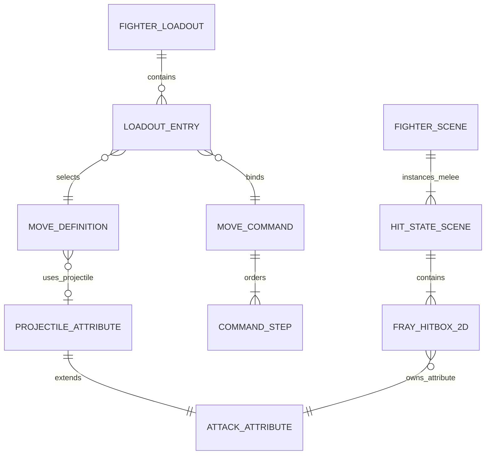
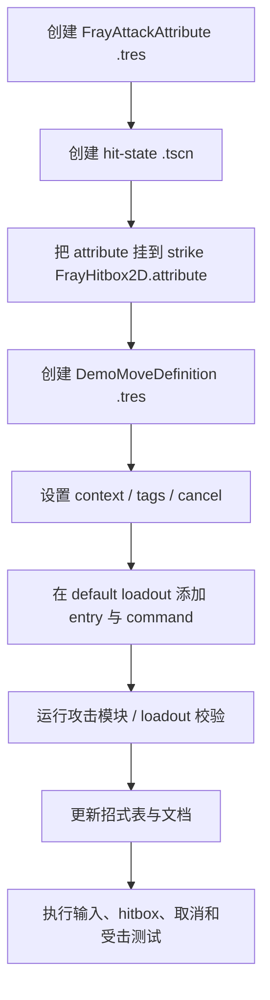

# 内容制作工作流

本文规定如何为 Fray Fighter Demo 新增或修改招式、攻击资源、静态 hit-state、角色配置和展示内容。核心原则是 **Fray-first** 与 **`FrayAttackAttribute` 单一数据源**。

## 1. 数据模型

实际职责：

| 资源 / 类型 | 唯一职责 |
|---|---|
| `DemoFighterLoadout` | 决定当前角色安装哪些 move 与 command |
| `DemoMoveLoadoutEntry` | 将一个 move 与一条 command 配对 |
| `DemoMoveCommand` / Step | 保存语义输入步骤，不保存物理键位 |
| `DemoMoveDefinition` | 保存显示信息、上下文、tag、优先级和取消关系；固定 melee 不引用 hit-state 场景 |
| `FrayAttackAttribute` | 保存所有攻击与受击反应数据 |
| `DemoProjectileAttackAttribute` | 只扩展 projectile 的速度、寿命、偏移、尺寸和缩放 |
| `FrayHitState2D` scene | 为固定 melee 提供 strike hitbox hierarchy，并静态实例化到 fighter 场景 |
| `FrayHitbox2D.attribute` | melee 攻击资源的实际挂载点 |

## 2. 新增 melee 招式

### 步骤

1. 在 `resources/attacks/` 创建 attack resource。
2. `id` 必须唯一，并计划与 move ID、攻击状态 ID 保持一致。
3. 填写 timing、damage、guard、stun、stop、juggle、knockdown 和 movement 数据。
4. 在 `scenes/hitboxes/` 创建或复制 Fray hit-state 场景。
5. hit-state 中 strike `FrayHitbox2D.attribute` 直接引用步骤 1 的 resource，并将 hit-state 根节点名设为 move ID。
6. 在 `resources/moves/` 创建 `DemoMoveDefinition`：
   - `id` 与 attack attribute ID 一致；
   - 固定 melee 不设置 `attack_attribute`，避免重复引用；
   - `activation_context` 为 `ground`、`crouch` 或 `air`；
   - 必须包含对应的 `ground_attack` 或 `air_attack` tag；
   - 设置 `neutral_available`、`combo_parent_move_id` 和 `cancel_target_move_ids`。
7. 把 hit-state 场景作为 `FacingRoot/AttackStateManager2D` 的子节点实例化到 `demo_fighter.tscn`，节点名保持为 move ID。
8. 在 loadout 创建 entry，并用语义输入步骤定义 command。
9. 在 fighter 场景的 `AnimationPlayer` 中添加同名动画；素材不完整时直接复用现有动画轨道。
10. 确认 `DemoFighterAttackModule` 能从静态 hit-state 的 strike attribute 建立索引，再更新数值文档和测试用例。

## 3. 新增 projectile 招式

Projectile 仍然使用 Fray-compatible attribute，不建立 projectile combat table。

1. 创建 `DemoProjectileAttackAttribute` resource。
2. 所有通用战斗数据继续填写在继承自 `FrayAttackAttribute` 的字段中。
3. 只在扩展字段填写 projectile 速度、寿命、出生偏移、尺寸和缩放。
4. `is_projectile = true`。
5. move definition 的 `attack_attribute` 指向该资源，并添加 `projectile` tag。
6. 投射物的 Sprite、`FrayHitbox2D`、`CollisionShape2D` 和 Shape 固定保存在 `demo_fighter_projectile.tscn`；脚本只应用属性、移动和处理寿命。
7. 攻击状态在 startup 结束时实例化该场景；projectile 接触必须调用 owner 的 `DemoFighterAttackModule.try_resolve_contact()`，仅成功结算后销毁。

## 4. Command 与 Fray 输入规则

### 允许的语义输入

`up`、`down`、`forward`、`back`、`left`、`right`、`light`、`heavy`、`special`、`block`。

### 约束

- command 不能为空，最多 12 步。
- 每一步至少有一个输入，且同一步不能重复同一输入。
- 复杂 command 的最后一步应包含攻击输入。
- 物理键位只存在于 `project.godot` InputMap；command 不写 `W/A/S/D/J/K/L`。
- 同帧多输入使用 `FrayCombinationInput`。
- 多步方向指令使用 `FraySequenceTree` / branch。
- `forward` / `back` 通过 facing conditional input 镜像。
- 新增输入识别需求时，优先扩展 Fray sequence/composite 配置，不新增自定义轮询器或第二套 buffer。

## 5. 状态机接入规则

每个已安装 move 由 builder 动态添加一个 `DemoFighterAttackState`：

- 地面 move 需要 `ground_attack` tag；空中 move 需要 `air_attack` tag。
- neutral 发动通过 Fray global press/sequence transition。
- 组合后续通过 move 之间的 Fray immediate cancel transition。
- 状态完成路径由 builder 统一创建，不在 move 脚本中手写状态分发。
- 外部战斗事件只允许在集中结算层调用 `goto(hitstun/blockstun/knockdown/ko)`。

禁止：

- 新建 enum/string switch 作为并行角色状态机。
- 在每个攻击脚本中散落 `goto()`。
- 用动画结束代替 `duration_frames`。
- 空中攻击绕过 `land` 直接回 neutral。

## 6. 文件与命名规范

| 内容 | 路径 | 命名示例 |
|---|---|---|
| 攻击属性 | `resources/attacks/` | `rising_uppercut.tres` |
| Move definition | `resources/moves/` | `rising_uppercut_move.tres` |
| Melee hit-state scene | `scenes/hitboxes/` | `rising_uppercut_hit_state.tscn` |
| 角色移动状态类 | `scripts/fighter/state_machine/states/locomotion/` | `demo_fighter_jump_state.gd` |
| 角色战斗反应状态类 | scripts/fighter/state_machine/states/reaction/ | demo_fighter_hitstun_state.gd |
| Demo 招式资源类型 | scripts/resources/moves/ | demo_move_definition.gd |

- 文件与函数使用 `snake_case`。
- `class_name` 使用 `PascalCase`；对外 Fray 类保持 `Fray` 前缀。
- Godot 文本使用 UTF-8 无 BOM，`.tres` / `.tscn` 第一个字节必须是 `[`。
- GDScript 使用 tab 缩进。
- 公共 API、export、signal 优先使用 `##` Godot 文档注释。

## 7. 内容校验清单

### Attack attribute

- [ ] `id` 非空且与 move ID 相同。
- [ ] startup、active、duration 范围合法。
- [ ] cancel window 未越过 duration。
- [ ] guard type 与招式表现一致。
- [ ] block damage、stun 和 stop 已评估。
- [ ] launch / juggle / knockdown 数据组成闭环。
- [ ] projectile 专属数据只存在于 Fray-compatible 子类。

### Move definition

- [ ] context 合法且包含对应 attack tag。
- [ ] melee 的同名 hit-state 已实例化到 fighter 的 `AttackStateManager2D`；projectile 直接引用 `DemoProjectileAttackAttribute`。
- [ ] neutral 后续段的 `neutral_available` 正确。
- [ ] combo parent 存在，且父 move 允许取消到该 move。
- [ ] 特殊技取消目标只在真实 cancel window 内消费。
- [ ] fighter 场景的 `AnimationPlayer` 中存在与状态/招式同名的动画；复用素材也不承担逻辑计时。

### Loadout / command

- [ ] entry 同时包含 move 与 command。
- [ ] command 使用语义方向。
- [ ] 复杂指令最后一步含攻击输入。
- [ ] 更复杂指令具有足够优先级，不被简单指令抢占。
- [ ] 招式表可从 loadout 自动生成，无 UI 重复表。

### 文档与测试

- [ ] 更新 combat 数值表与指令表。
- [ ] 更新架构图或状态图（若拓扑变化）。
- [ ] 增加至少一个正向、一个失败/边界测试。
- [ ] 在可用 Godot 环境中执行 headless load 与 fighter demo 手测。
