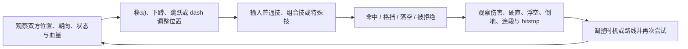
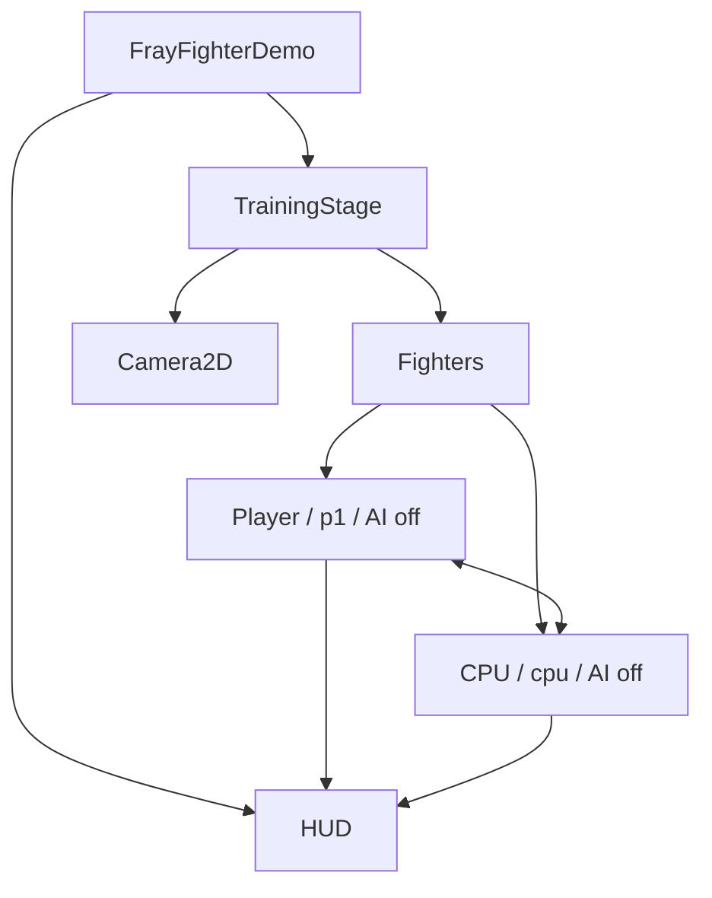
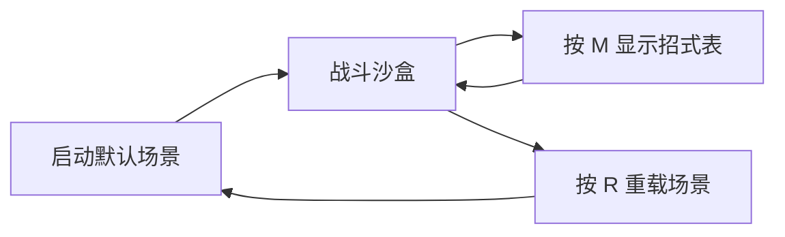

# Fray Fighter Demo 游戏设计文档

> 文档类型：轻量 GDD / 产品规格  
> 现状基线：2026-07-30  
> 默认场景：`res://scenes/fray_fighter_demo.tscn`

## 1. 产品定位

这是一个基于 Godot 4 与 Fray addon 的 **2D 格斗系统演示和训练沙盒**。其首要目标不是提供完整比赛内容，而是展示以下技术和玩法闭环：

- 固定键位如何接入 Fray 输入映射、组合输入、序列输入和输入缓冲。
- 角色流程如何通过 Fray 状态机、tag、rule、condition 和 transition 表达。
- 近战与 projectile 如何使用 Fray hit state / hitbox 与统一接触结算。
- 攻击时序、伤害、硬直、击退、浮空、倒地和 hitstop 如何由 `FrayAttackAttribute` 单一驱动。

### 目标用户

- 评估或学习 Fray addon 的 Godot 开发者。
- 需要验证格斗输入、状态机和 hitbox 架构的程序与技术策划。
- 为后续角色、训练场或 round/match 系统制作原型的团队成员。

### 非目标

当前版本不以以下内容为交付目标：

- 完整商业格斗游戏的角色量、关卡量和演出质量。
- 在线对战、匹配、rollback netcode 或排行榜。
- 完整 round/match、计时器和胜局流程。
- 可重绑键位、F1 配置、运行时招式安装/卸载或配置存档。
- 已启用的 CPU 对战逻辑、完整训练 dummy 设置或完整 throw 系统。

## 2. 核心体验支柱

| 支柱 | 设计含义 | 当前实现证据 |
|---|---|---|
| 输入可读且可复现 | 单键、组合键、方向序列和取消都应有稳定语义 | Fray map/controller/combination/sequence/buffer |
| 逻辑帧确定性 | 攻击判定与取消窗口不依赖动画时长或真实时间 | 34 Hz gameplay frame；`FrayAttackAttribute` 帧数据 |
| 数据唯一来源 | 战斗数值不能散落在角色脚本、UI 或第二张表中 | strike `FrayHitbox2D.attribute` 上的 attack resource |
| 状态拓扑可审查 | 移动、攻击、受击和恢复路径集中表达 | `DemoFighterStateMachineBuilder` |
| 命中结果可信 | 失败接触不能提前消费目标或销毁 projectile | `DemoFighterAttackModule.try_resolve_contact()` + `receive_hit(): bool` |

## 3. 玩家循环

这是训练沙盒循环，不存在正式 round end。角色进入 `ko` 后，可按 `R` 重载当前场景重新开始。

## 4. 场景与参与者

### 场景组成

- 960 × 540 视口。
- 固定训练舞台、地面、左右边界、摄像机和两个出生点。
- 玩家角色使用 `p1_*` InputMap action。
- 对手使用 `cpu_*` 语义前缀，但默认 `ai_enabled = false`，因此是静止 dummy。
- HUD 显示双方血量、当前 Fray 状态、连段信息、固定控制提示和招式表。

## 5. 控制规格

| 玩家意图 | 默认键位 | 语义输入 |
|---|---:|---|
| 左移 / 右移 | `A` / `D` | `left` / `right` |
| 跳跃 / 二段跳 | `W` | `up` |
| 下蹲 | `S` | `down` |
| 轻击 | `J` | `light` |
| 重击 | `K` | `heavy` |
| 特殊攻击 | `L` | `special` |
| 防御 / 受身滚动输入 | `;` | `block` |
| 打开 / 关闭招式表 | `M` | `move_list` |
| 重启场景 | `R` | `restart_demo` |

### 控制原则

- `forward` / `back` 是相对角色朝向的语义输入，不等同于固定左右键。
- 双方换边后，Fray conditional input 自动镜像特殊技方向。
- 跳跃高度固定；松开 `W` 不截断上升。
- 防御使用独立 `block` 输入，不采用“按住后方向”规则。
- 当前键位固定，运行时不读取或保存自定义映射。

## 6. 玩法规则

### 移动

- 地面可在 `idle`、`walk`、`crouch` 之间自动切换。
- 双击相对前/后方向触发 forward/back dash。
- 跳跃包含 `jump_start -> jump -> fall -> land`。
- 起跳瞬间确定水平速度；普通跳跃、下落和空中攻击期间，左右输入不能修正或反转既有轨迹。
- 空中允许一次 `double_jump`；发动二段跳的瞬间可以重新选择方向，随后再次锁定水平轨迹。
- `land` 提供统一落地恢复；空中攻击接地也必须进入该状态。
- 角色 pushbox 负责互推并约束角色原点不越过舞台左右边界。
- Pushbox 重叠时双方默认各承担一半分离距离；墙角一方无法移动时，剩余距离由另一方承担。

### 攻击

- 默认 loadout 包含 15 个 move：地面普通技、蹲姿技、空中技、三条组合路线和三种特殊技。
- 每个 move 在 Fray 状态机中拥有独立攻击状态。
- startup、active、cancel 和 duration 以 gameplay frame 计数。
- 攻击动画仅为表现层，不决定攻击状态何时结束。
- Ground Wave 在 startup 结束时生成 runtime projectile；其 melee `active_frames` 为 0。

### 防御与受击

- Mid：站防或蹲防均可。
- Low：仅蹲防可防。
- Overhead：仅站防可防。
- 空中防御还要求 `can_air_block = true`，且角色处于 airborne 或 air blockstun。
- 防御造成 chip damage；chip 可导致 KO。
- 命中可造成 hitstun、launch、soft/hard knockdown、hitstop 和连段累计。
- knockdown 与 recovery 目前作为受击无敌状态；demo 尚无 OTG attack-side 属性。

### 连段与取消

- 组合后续段不能从 neutral 单独发动。
- 取消必须同时满足：源 move 允许目标 move、当前帧处于 attribute 的 cancel window、目标指令已进入 Fray buffer。
- hitstop 冻结 buffer aging，但仍允许收集输入。
- 普通攻击期间可以暂停消费缓冲，但 gameplay clock 继续推进。

## 7. UI / UX 规格

### HUD 信息层级

1. **主要信息**：双方血量。
2. **调试 / 学习信息**：当前 Fray 状态、连段 hit 数和累计伤害。
3. **操作提示**：固定键位摘要。
4. **按需信息**：由 loadout 自动生成的招式表。

招式表必须从 `DemoFighterLoadout` 读取指令、组合父级和取消目标，不能维护 UI 专用的第二份招式定义。

## 8. 视听与反馈基线

当前视听属于功能原型：

- 角色使用 `assets/sprites/` 中的 sprite strip。
- 玩家与 dummy 使用不同颜色，便于区分双方。
- `AnimationPlayer` 负责视觉播放；`FrayAnimationObserver` 仅在需要观察一次性动画的恢复状态中参与逻辑。
- `FrayAttackAttribute` 已预留 hit/block spark、SFX 和 screen shake 数据位，但当前内容不构成完整反馈套件。
- 当前没有正式音频风格、VFX 风格、角色比例和动画制作规范；进入正式内容制作前应新增独立的 art/audio bible。

## 9. 功能范围表

| 范围 | 功能 |
|---|---|
| 已完成基线 | 固定输入、移动、二段跳、dash、15 个 move、三条组合路线、三种特殊技、取消、格挡、chip、连段缩放、juggle、倒地、受身滚动、hitstop、KO、HUD、招式表 |
| 下一阶段优先 | 自动化回归、训练 dummy 设置、战斗调试可视化 |
| 中期候选 | round/match、双设备本地对战、正式训练模式 |
| 后期候选 | throw/throw-tech、armor/counter-hit/OTG、正式 VFX/SFX、更多角色和舞台 |
| 明确不在当前版本 | 在线对战、可重绑配置、运行时 loadout 编辑、配置存档、已启用 CPU 对战 |

## 10. 成功标准

当前 demo 可视为满足设计目标，需要同时达到：

1. 默认场景能加载并创建玩家、静止 dummy 与 HUD。
2. 基础移动、跳跃、二段跳、dash 和下蹲可通过 Fray 状态机完成。
3. 固定普通技、组合技和特殊技可稳定识别，换边后方向语义正确。
4. 取消只在合法窗口发生，hitstop 内预输入不会因真实时间流逝而过期。
5. 所有战斗数值来自 `FrayAttackAttribute`。
6. melee 与 projectile 只在 `receive_hit()` 成功后消费目标。
7. 空中攻击接地进入 `land`；受击、格挡、倒地、恢复与 KO 状态路径一致。
8. HUD 和招式表与实际 loadout、状态和连段数据一致。

详细验证步骤见 [测试与验收计划](test-plan.md)。