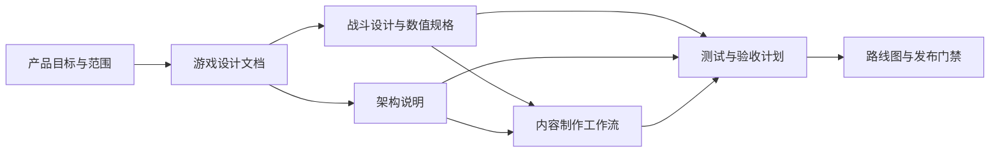

# Fray Fighter Demo 文档中心

本文档集记录 **2026-07-30 工作区中的实际 demo**，默认入口为 `res://scenes/fray_fighter_demo.tscn`。文档以“足够支撑开发、评审、测试和后续扩展”为目标，不把尚未实现的系统写成现有功能。

## 游戏制作通常需要哪些文档

完整游戏项目常见的文档可以分为以下几类。小型 demo 不需要为每一类都建立厚重文档，但必须保证关键决策有唯一、可维护的记录。

| 文档类型 | 主要回答的问题 | 本 demo 的落点 | 维护时机 |
|---|---|---|---|
| 产品愿景 / One-pager | 做什么、给谁玩、核心体验是什么 | [游戏设计文档](game-design.md) | 目标受众、范围或核心体验变化时 |
| 游戏设计文档（GDD） | 玩家做什么、规则是什么、如何形成体验 | [游戏设计文档](game-design.md) | 新增或修改玩法规则时 |
| 系统专项设计 | 战斗、成长、经济、关卡等系统如何运作 | [战斗设计与数值规格](combat-design.md) | 攻防、招式、连段和数值变化时 |
| 控制与 UX 规格 | 如何输入、界面显示什么、反馈如何呈现 | [游戏设计文档](game-design.md)、[Demo README](../README.md) | 键位、HUD、流程变化时 |
| 技术设计文档（TDD） | 模块如何协作、数据如何流动、边界在哪里 | [架构说明](architecture.md) | 组件、状态机、输入或命中链路变化时 |
| 内容与数据规范 | 资源如何创建、命名、校验和接入 | [内容制作工作流](content-workflow.md) | 新增招式、角色、场景或资源类型时 |
| 美术 / 音频规范 | 风格、规格、导入、命名和预算是什么 | 当前仅在 [游戏设计文档](game-design.md#视听与反馈基线) 记录原型基线 | 进入正式美术或音频制作前应独立成册 |
| 制作计划 / 路线图 | 先做什么、何时算完成、风险是什么 | [路线图](roadmap.md) | 里程碑、优先级和范围变化时 |
| QA / 测试计划 | 如何证明功能正确、如何防止回归 | [测试与验收计划](test-plan.md) | 每次功能或架构改动时 |
| 发布 / 运营文档 | 如何构建、发布、回滚和维护 | 当前只保留测试文档中的发布门禁 | 准备对外发布或持续运营时补充 |
| 叙事 / 本地化文档 | 世界观、剧情、文本和术语如何统一 | 当前 demo 无叙事需求 | 引入剧情、角色文本或多语言时补充 |

## 本 demo 的文档结构

### 阅读路径

- **第一次了解 demo**：先读 [游戏设计文档](game-design.md)，再读 [Demo README](../README.md)。
- **修改输入、状态机、hitbox 或战斗结算**：读 [架构说明](architecture.md) 和 [战斗设计与数值规格](combat-design.md)。
- **新增招式或资源**：按 [内容制作工作流](content-workflow.md) 执行。
- **提交前验证**：按 [测试与验收计划](test-plan.md) 执行。
- **规划下一阶段**：查看 [路线图](roadmap.md)。

## 文档事实来源

文档中的现状描述以以下资源为准：

1. `project.godot`：入口场景、固定 InputMap、34 Hz physics tick。
2. `resources/fighters/default_fighter_loadout.tres`：默认招式与指令集合。
3. `resources/moves/*.tres`：招式上下文、tag、取消关系和展示名称。
4. `resources/attacks/*.tres`：`FrayAttackAttribute` 战斗数据。
5. `scripts/fighter/state_machine/demo_fighter_state_machine_builder.gd`：状态拓扑和 Fray transition。
6. `scripts/fighter/combat/demo_fighter_combat_resolver.gd`：格挡、伤害、juggle、倒地和 KO 结算。
7. `scripts/stage/core/demo_stage.gd`：玩家、静止 dummy 和 HUD 的实际舞台流程。

若文档与资源冲突，先以运行代码和资源为事实依据，再在同一修改中更新文档。

## 文档维护规则

- 不把“计划中”“保留接口”写成“已完成功能”。
- 攻击数值表只用于阅读和评审；**可执行真值仍是 `FrayAttackAttribute` 资源**。
- 图表必须与 Fray-first 规则一致，不画出不存在的 Godot-native 并行状态机或第二套攻击数据库。
- 变更输入、状态、move、attribute、场景节点或测试步骤时，同步更新相关文档。
- Markdown 与 Mermaid 图表使用 UTF-8 无 BOM；相对链接应从当前文件位置可解析。

## 脚本级参考

- [Demo 脚本参考](script-reference.md)：逐一说明 scripts/ 中每个脚本的职责、存在意义、主要协作对象与修改定位。
