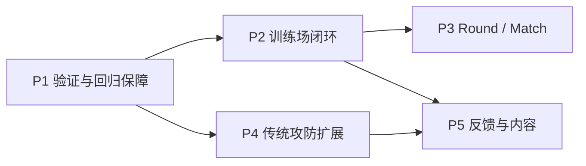

# Fray Fighter Demo 路线图

本文以 **2026-07-30 的实际代码**为基线。它不再把已经回退的配置系统写成已完成功能。

## 当前定位

Demo 的目标是验证一条 Fray-first 的传统横板格斗最小链路：

```text
Fray 输入
-> FrayBufferedInputAdvancer
-> Fray 状态机 transition
-> FrayState
-> FrayHitState2D / FrayHitbox2D
-> FrayAttackAttribute
-> 受击、格挡、连段、倒地与 KO
```

当前默认场景使用固定 P1 键位、固定 loadout 和静止对手，重点是框架集成与战斗规则验证，不是完整可发行格斗游戏。

## 已完成基线

### 输入与招式

- 固定 `project.godot` `p1_*` action 接入 `FrayInputMap` / `FrayController`。
- `FrayConditionalInput` 表达相对朝向的 forward/back。
- `FrayCombinationInput` 表达同帧组合。
- `FraySequenceTree` 表达 dash 和特殊技 command。
- `FrayBufferedInputAdvancer` 驱动 press/sequence transition。
- 固定 `DemoFighterLoadout` 提供招式、command、组合父级和 cancel target。

### 状态机与移动

- neutral、dash、jump、double jump、fall、land。
- 每个 move 对应 `DemoFighterAttackState`。
- hitstun、blockstun、knockdown、wakeup、tech roll、KO。
- 状态拓扑、tag、rule 和 condition 由 Fray builder 管理。

### 命中与战斗

- 固定 melee move 使用可复用 `FrayHitState2D` provider。
- Projectile 使用 runtime `FrayHitbox2D`，attribute 仍是 `FrayAttackAttribute` 子类。
- guard type、空防、chip KO、hitstop/blockstop。
- combo scaling、juggle limit、launch、knockdown 和 wakeup。
- `FrayAttackAttribute` 是攻击与受击反应数据的唯一来源。

### 展示

- HUD 血量、状态、连段和固定控制提示。
- `M` 打开固定 loadout 的招式表。
- `R` 重启默认场景。

## 2026-07-30 一致性修复

本轮解决审查中的 2、3、4、5、6、7、9：

1. **空中攻击落地**：`air_attack` 接地时 immediate transition 到 `land`；空中按时结束才进入 `fall`。
2. **确定性攻击结束**：攻击状态只由 `FrayAttackAttribute.duration_frames` 结束，不再读取攻击动画完成信号。
3. **成功后再消费接触**：只有 `receive_hit()` 返回 `true` 才缓存 target。
4. **删除重复 signal**：`DemoFighterAttackModule` 只监听 manager 重发的 `hitbox_intersected`，不再直接连接 child hit state。
5. **统一 melee/projectile**：由 `DemoFighterAttackModule.try_resolve_contact()` 共用 source 过滤、attribute 读取、target cache 和成功判定。
6. **暂停感知 buffer clock**：`FrayBufferedInputAdvancer` 使用 gameplay delta clock；hitstop 冻结老化但不阻止收集输入。
7. **文档去除回退功能陈述**：README、architecture 和 roadmap 统一描述固定键位、固定 loadout、无 F1/存档和静止 dummy 的实际状态。

## 当前不属于已完成功能

以下内容曾出现在旧计划或旧文档中，但当前代码已经回退或从未形成完整闭环：

- 可重绑键位与控制 profile
- F1 配置 UI
- runtime 招式安装/卸载
- command 录制与编辑
- version 2 或其他版本化配置存档
- 默认启用的 CPU 自动格挡/对战逻辑
- round、match、计时器和胜负重开流程
- 完整 training dummy 行为设置
- 完整 throw / throw-tech 状态与演出

后续若重新实现，必须重新按 Fray-first 规则设计和验收，不能因为旧文档曾描述过就视为现成功能。

## 后续优先级



优先关系表示依赖，不承诺具体日期：先建立可重复验证基线，再扩展训练功能与比赛流程；新的攻防和表现内容必须继续服从 Fray-first 与 attribute 单一来源。

### P1：验证与回归保障

- 为 input buffer clock、攻击模块接触方法和空中攻击 landing transition 增加可自动运行的最小测试场景或测试脚本。
- 增加攻击资源校验：startup/active/cancel 不得越过 duration。
- 增加 provider 校验：固定 melee move 必须提供 `FrayAttackAttribute` strike；projectile move 必须使用 compatible attribute。
- 在可用 Godot 环境中执行 headless load 和 fighter demo 手测。

### P2：训练场闭环

- 增加明确的 dummy 状态设置：站立、蹲伏、防御、受击后行为。
- 若启用 AI，只通过 `FrayVirtualDevice` 发出语义输入，不直接跳状态或调用攻击逻辑。
- 增加 hitbox、damage scaling、juggle 和 input buffer 的可视化调试信息。

### P3：Round / Match

- round start / fight / KO / round end 状态。
- 计时器、胜局和重开规则。
- 双方输入设备分配与本地双人控制。
- 将 stage flow 与 fighter Fray 状态机保持解耦。

### P4：传统攻防扩展

- 以 Fray-compatible attribute 扩展 throw 数据。
- 用独立 `FrayState` 完成 throw、throw victim 和 throw tech 流程。
- 增加更完整的 invulnerability、OTG、armor 或 counter-hit 数据时，优先扩展 attribute/rule，而不是在 fighter 中散装参数。

### P5：反馈与内容

- 用 attribute 的 spark/SFX/shake 参数补齐命中反馈资源。
- 增加正式角色动画和 projectile 美术。
- 在逻辑帧与视觉动画继续解耦的前提下校准表现。

## 设计约束

后续工作必须保持：

1. 输入优先使用 Fray map、controller、virtual device、combination、sequence 和 buffer。
2. 状态类继承 `FrayState`，拓扑集中在 builder。
3. 攻击数值和反应只来自 `FrayAttackAttribute`。
4. 固定 melee 使用 Fray hit-state provider；projectile 使用 runtime Fray hitbox。
5. 外部受击事件可集中 `goto()`，任意状态跳转不能散落在组件中。
6. 动画是表现层，不得成为攻击 active/cancel/duration 的第二时钟。
7. 失败接触不得提前消费 target 或 projectile。

## 验证清单

### 静态

- Godot 文本 UTF-8 无 BOM。
- `.tres` / `.tscn` 首字节是 `[`。
- `res://` 引用存在。
- attack state 不再含 `animation_finished` 完成条件。
- combat boxes 不再含 `_connect_attack_hit_states`。
- 相关 buffer/cancel 逻辑不再用 `Time.get_ticks_msec()` 老化。
- 文档不再声称 F1、自定义控制、安装/卸载、存档或 CPU 自动 block 已可用。

### 运行时

1. 基础移动、跳跃、下蹲、dash。
2. 单键、组合、三种特殊技及换边镜像。
3. 三条组合路线和特殊技取消。
4. hitstop 内提前输入取消。
5. 空中攻击接地进入 `land`。
6. melee/projectile 成功命中只结算一次。
7. 被无敌或 juggle 拒绝的接触不被提前消费。
8. block、chip KO、launch、knockdown、wakeup、tech roll 和 KO。

## 本机验证限制

当前工作区机器没有可用的 `godot` / `godot4` PATH 命令，且当前 checkout 的 `git status --short` 会因权限错误失败。因此本轮只能完成静态检查；运行时验证需在提供 Godot 可执行文件路径或可用编辑器环境后执行。
