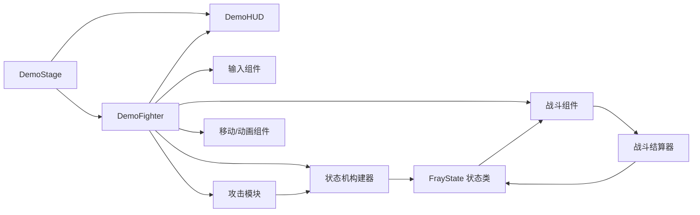

# Fray Fighter Demo 脚本参考

本文档按 `scripts/` 中的 **40 个 GDScript 脚本**逐一说明其职责、存在意义与主要协作关系。它是 [`architecture.md`](architecture.md) 的脚本级补充：架构文档解释数据流和组件边界，本文档用于快速定位“某个脚本负责什么、应改哪里、会影响谁”。

> **范围与原则**
>
> - 本文档只覆盖 Demo 脚本；Fray addon 的实现请查阅 `addons/fray/src/` 与 `addons/fray/docs/`。
> - “关联”描述运行时直接协作、构造、调用、信号或数据交接关系，不等同于所有文本引用。
> - 角色流程仍由 Fray 状态机、输入系统和 hitbox 系统负责；Demo 脚本不维护并行状态机或第二份攻击数值表。
> - 攻击和受击数值以挂在 `FrayHitbox2D.attribute` 上的 `FrayAttackAttribute`（或其 `DemoProjectileAttackAttribute` 扩展）为唯一来源。

## 阅读图例

- **使用 →**：当前脚本主动读取、调用、构造或配置目标。
- **被使用 ←**：通常由目标脚本创建、调用、注册或驱动当前脚本。
- **经由 `DemoFighter`**：许多薄组件不彼此持有强耦合引用，而是由角色门面统一装配；状态脚本也通过状态上下文取得 `DemoFighter`。

## 1. 舞台与界面

| 脚本 | 功能与意义 | 主要关联 |
|---|---|---|
| `stage/core/demo_stage.gd` (`DemoStage`) | 默认训练舞台协调器：实例化玩家与静止 dummy、赋予固定共享 loadout、互设 `opponent`、放置出生点、刷新 hitbox、控制跟随镜头，并处理重新开始输入。它是 Demo 场景的运行入口。 | **使用 →** `demo_fighter.gd`、`demo_hud.gd`、`demo_fighter_loadout.gd`、`demo_fighter_environment.gd`；**被使用 ←** `fray_fighter_demo.tscn`。 |
| `stage/ui/demo_hud.gd` (`DemoHUD`) | 将角色生命、状态、连段、KO 与固定操作提示显示到 UI；按当前 loadout 生成招式表，避免维护第二份 UI 招式数据。 | **使用 →** `demo_fighter.gd` 的信号和状态机、`demo_move_list_formatter.gd`、`demo_fighter_loadout.gd`；**被使用 ←** `demo_stage.gd`。 |
| `stage/ui/demo_move_list_formatter.gd` (`DemoMoveListFormatter`) | 把 loadout、招式命令、连段父级和取消目标格式化成 HUD 所需的 BBCode。它只做展示转换，不参与输入识别或战斗结算。 | **使用 →** `demo_fighter_loadout.gd`、`demo_move_loadout_entry.gd`、`demo_move_definition.gd`、`demo_move_command.gd`；**被使用 ←** `demo_hud.gd`。 |

## 2. 角色门面与装配

| 脚本 | 功能与意义 | 主要关联 |
|---|---|---|
| `fighter/core/demo_fighter.gd` (`DemoFighter`) | `CharacterBody2D` 角色门面，也是 Demo 的装配中心。它缓存场景中固定的 hit-state，创建输入、招式、移动、战斗、连段和 AI 组件，保存自身 gameplay-frame hitstop 计数，并暴露场景 `AnimationPlayer`；向状态类暴露薄接口；转发受击、投射物、信号和 HUD 所需数据。这里应保持“协调与访问入口”职责，具体规则应留在对应组件或 Fray state 中。 | **使用 →** 本文所有 fighter 组件、`demo_fighter_state_machine_builder.gd`、`demo_fighter_projectile.gd`、环境/loadout 资源；**被使用 ←** `demo_stage.gd`、`demo_hud.gd`、所有状态脚本、攻击模块。 |
| `fighter/state_machine/demo_fighter_state_machine_builder.gd` (`DemoFighterStateMachineBuilder`) | 用 `FrayCompoundState.builder()` 创建状态实例、tag、rule、condition 和 Fray transition。它把输入、已安装招式、取消规则与状态拓扑集中在一个位置，避免 enum/string 分发式状态机。 | **使用 →** 16 个 `FrayState` 脚本、`demo_fighter_loadout.gd`、`demo_move_definition.gd`、`DemoFighter` 暴露的 condition/input；**被使用 ←** `demo_fighter.gd`。 |

## 3. 输入与命令

| 脚本 | 功能与意义 | 主要关联 |
|---|---|---|
| `fighter/input/demo_fighter_input_setup.gd` (`DemoFighterInputSetup`) | 将 `project.godot` 的固定 InputMap action 注册到 `FrayInputMap`；构建朝向镜像的 forward/back/down-forward 组合输入；为已安装复杂指令创建组合输入和 `FraySequenceTree`，再让 `FrayBufferedInputAdvancer` 监听。 | **使用 →** `demo_fighter.gd`、`demo_fighter_loadout.gd`、`demo_move_command.gd`、`demo_move_command_step.gd`、Fray 输入 API；**被使用 ←** `demo_fighter.gd`。 |
| `fighter/input/demo_fighter_combo_input.gd` (`DemoFighterComboInput`) | 在攻击的取消窗口内，从 Fray 输入缓冲匹配可取消目标并精确消费对应缓冲事件。它不建立第二套 buffer，而是使用 `FrayBufferedInputAdvancer`。 | **使用 →** `demo_fighter.gd`、`demo_fighter_loadout.gd`、`demo_move_command.gd`、Fray input buffer；**被使用 ←** `demo_fighter.gd`，并由 `demo_fighter_attack_state.gd` 经角色门面开启、更新和关闭取消窗口。 |
| `fighter/input/demo_fighter_virtual_ai.gd` (`DemoFighterVirtualAI`) | 面向非玩家角色的可选虚拟设备输入器：向 `FrayController` 写入模拟输入。默认舞台明确关闭 `ai_enabled`，因此当前 dummy 不主动战斗；该脚本保留为后续启用 AI 的接入点。 | **使用 →** `demo_fighter.gd`、`FrayController`；**被使用 ←** `demo_fighter.gd`（仅非玩家且启用 AI 时）。 |

## 4. 招式、攻击资源与场景索引

| 脚本 | 功能与意义 | 主要关联 |
|---|---|---|
| `fighter/combat/demo_fighter_attack_module.gd` (`DemoFighterAttackModule`) | 角色的直接攻击模块：查找 fighter 场景中固定的 `FrayHitState2D`，从 strike 读取唯一 `FrayAttackAttribute`，缓存场景引用，并负责攻击框窗口、即时 overlap、melee/projectile 统一接触过滤和目标缓存。投射物只直接使用 move 上的 projectile attribute。 | **使用 →** loadout、move definition、`demo_fighter.gd`、Fray hit state/hitbox；**被使用 ←** `demo_fighter.gd`、`demo_fighter_projectile.gd`、状态机构建器。 |
| `resources/fighter/demo_fighter_loadout.gd` (`DemoFighterLoadout`) | 固定角色招式表资源：保存启用的 `DemoMoveLoadoutEntry`，提供条目/命令查询、取消目标和资源校验。当前双方共享不可变的默认 `.tres`，不提供运行时安装、编辑或复制。 | **使用 →** `demo_move_loadout_entry.gd`、`demo_move_definition.gd`、`demo_move_command.gd`；**被使用 ←** `demo_stage.gd`、`demo_fighter.gd`、输入设置、攻击模块、状态机构建器、HUD formatter。 |
| `resources/moves/demo_move_loadout_entry.gd` (`DemoMoveLoadoutEntry`) | loadout 的单个固定条目：将一个招式定义与一条实际命令绑定。 | **使用 →** `demo_move_definition.gd`、`demo_move_command.gd`；**被使用 ←** `demo_fighter_loadout.gd`、输入设置、状态机构建器、HUD formatter。 |
| `resources/moves/demo_move_definition.gd` (`DemoMoveDefinition`) | 招式元数据资源：保存显示文本、状态 tag、指令前置条件和连段/取消关系。固定 melee 不引用 hit-state 场景或攻击资源；只有投射物直接保存 projectile attribute。 | **使用 →** `DemoProjectileAttackAttribute`；**被使用 ←** loadout、攻击模块、builder、formatter。 |
| `resources/moves/demo_move_command.gd` (`DemoMoveCommand`) | 一条招式命令资源：由有序步骤组成，提供简单按键判定、复杂度、签名与校验。它是 Fray sequence/combo input 的数据来源。 | **使用 →** `demo_move_command_step.gd`；**被使用 ←** loadout entry、input setup、combo input、HUD formatter。 |
| `resources/moves/demo_move_command_step.gd` (`DemoMoveCommandStep`) | 命令的一个步骤：保存同时按下的输入集合和允许的步骤间隔。 | **被使用 ←** `demo_move_command.gd`、`demo_fighter_input_setup.gd`。 |
| `resources/combat/demo_projectile_attack_attribute.gd` (`DemoProjectileAttackAttribute`) | 对 `FrayAttackAttribute` 的 Fray-compatible 扩展，仅新增投射物速度、寿命、生成偏移、大小和显示缩放；不会复制通用攻击/受击数据。 | **使用 →** `FrayAttackAttribute`；**被使用 ←** `demo_move_definition.gd`、`demo_fighter_attack_state.gd`、`demo_fighter_projectile.gd`、攻击模块。 |
| `resources/fighter/demo_fighter_environment.gd` (`DemoFighterEnvironment`) | 角色环境参数资源，集中保存地面、dash、跳跃、重力、倒地、受身和舞台边界参数；它是移动行为的配置来源，不是状态机。 | **被使用 ←** `demo_stage.gd`、`demo_fighter.gd`、`demo_fighter_movement.gd`、`demo_fighter_pushbox.gd`。 |

## 5. 战斗、命中与连段

| 脚本 | 功能与意义 | 主要关联 |
|---|---|---|
| `fighter/combat/demo_fighter_combat_resolver.gd` (`DemoFighterCombatResolver`) | 集中结算受击：格挡判定、block damage、伤害、双人对战连段会话、连段缩放、juggle 上限、击退、浮空、倒地、hitstun、blockstun、hitstop 和 KO，并直接发出 HUD 所需的角色连段信号。外部战斗事件仅在这里集中调用 Fray `goto()`。 | **使用 →** `demo_fighter.gd`、`FrayAttackAttribute` 与角色状态机；**被使用 ←** `demo_fighter.gd` 的 `receive_hit()` 和 neutral 状态切换回调。 |
| `fighter/combat/demo_fighter_projectile.gd` (`DemoFighterProjectile`) | 静态 `.tscn` 投射物的薄行为脚本：把原始攻击 attribute 应用到场景已有的 `FrayHitbox2D`，按速度移动、检测已有重叠，并调用 owner 攻击模块的统一接触方法；只有成功命中后销毁，寿命结束也会清理。 | **使用 →** `demo_projectile_attack_attribute.gd`、`demo_fighter_attack_module.gd`、`demo_fighter.gd`、Fray hitbox；**被使用 ←** `demo_fighter.gd`，由攻击状态在 startup 完成后经角色门面生成。 |

## 6. 移动与视觉

| 脚本 | 功能与意义 | 主要关联 |
|---|---|---|
| `fighter/movement/demo_fighter_movement.gd` (`DemoFighterMovement`) | 角色运动服务：读取 environment 参数，执行走路、dash、空中控制、重力、攻击位移、击退摩擦、倒地摩擦、受身翻滚与 `move_and_slide()`。状态类表达流程，实际速度计算集中在此处。 | **使用 →** `demo_fighter.gd`、`demo_fighter_environment.gd`、`demo_fighter_pushbox.gd`、`FrayAttackAttribute`；**被使用 ←** `demo_fighter.gd` 和所有角色状态。 |
| `fighter/movement/demo_fighter_pushbox.gd` (`DemoFighterPushbox`) | 角色物理 pushbox：根据站立、蹲下、空中姿态调整碰撞形状；参与双角色互推、墙角剩余位移分配及角色原点舞台边界约束。 | **使用 →** `demo_fighter.gd`、环境的舞台边界；**被使用 ←** `demo_fighter.gd` 装配、`demo_fighter_movement.gd`。 |

## 7. Fray 状态脚本

所有以下脚本均继承 `FrayState`，由 `demo_fighter_state_machine_builder.gd` 注册、构造和连接 transition。它们从状态上下文获得 `DemoFighter`，经角色门面访问移动、动画、hitbox 与输入组件；不自行搭建另一套状态机。

### 7.1 攻击状态

| 脚本 | 功能与意义 | 主要关联 |
|---|---|---|
| `fighter/state_machine/states/combat/demo_fighter_attack_state.gd` (`DemoFighterAttackState`) | 每个已安装招式对应一个攻击状态实例。它逐物理帧按 `FrayAttackAttribute` 推进攻击帧、攻击位移、hitbox active window 和取消窗口；若属性是投射物扩展，则在 startup 后仅生成一次投射物。 | **使用 →** `demo_fighter.gd` 门面、`demo_fighter_movement.gd`、`demo_fighter_attack_module.gd`、`demo_fighter_combo_input.gd`、`demo_fighter_projectile.gd`、`demo_projectile_attack_attribute.gd`；**被使用 ←** 状态机构建器。 |

### 7.2 移动状态

| 脚本 | 功能与意义 | 主要关联 |
|---|---|---|
| `fighter/state_machine/states/locomotion/demo_fighter_idle_state.gd` (`DemoFighterIdleState`) | 站立中立状态：清理攻击、启用站姿 hurtbox、恢复可跳状态，并施加地面摩擦。它是多数地面流程和招式输入 transition 的基础入口。 | **使用 →** `demo_fighter.gd`、`demo_fighter_movement.gd`、fighter 场景 `AnimationPlayer`；**被使用 ←** 状态机构建器及其他状态的完成 transition。 |
| `fighter/state_machine/states/locomotion/demo_fighter_walk_state.gd` (`DemoFighterWalkState`) | 地面行走状态：维持站姿 hurtbox，按 FrayController 的水平轴输入调用 walk motion。 | **使用 →** `demo_fighter.gd`、`demo_fighter_movement.gd`、fighter 场景 `AnimationPlayer`；**被使用 ←** 状态机构建器。 |
| `fighter/state_machine/states/locomotion/demo_fighter_crouch_state.gd` (`DemoFighterCrouchState`) | 蹲下状态：启用蹲姿 hurtbox、保持地面摩擦，作为低防和可从蹲姿发动合法攻击的状态基础。 | **使用 →** `demo_fighter.gd`、`demo_fighter_movement.gd`、combat boxes；**被使用 ←** 状态机构建器、战斗结算器的防御逻辑（通过角色当前状态/输入查询）。 |
| `fighter/state_machine/states/locomotion/demo_fighter_dash_state.gd` (`DemoFighterDashState`) | 前/后 dash 的参数化状态。构建器分别以相对方向创建 `dash_forward` 和 `dash_back`；状态读取 environment 的时长、速度、加速和刹车配置来推进。 | **使用 →** `demo_fighter.gd`、`demo_fighter_movement.gd`、`demo_fighter_environment.gd`；**被使用 ←** 状态机构建器的 Fray 双击方向 sequence transition。 |
| `fighter/state_machine/states/locomotion/demo_fighter_jump_start_state.gd` (`DemoFighterJumpStartState`) | 起跳前摇状态：锁定起跳方向、保留站姿与地面移动，达到 environment 定义的起跳前摇后转入跳跃。 | **使用 →** `demo_fighter.gd`、`demo_fighter_movement.gd`、environment；**被使用 ←** 状态机构建器。 |
| `fighter/state_machine/states/locomotion/demo_fighter_jump_state.gd` (`DemoFighterJumpState`) | 上升跳跃状态：设置空中 hurtbox、启动格斗游戏式跳跃初速度和空中水平控制；达到最短上升时间且竖直速度转为下落时完成。 | **使用 →** `demo_fighter.gd`、`demo_fighter_movement.gd`；**被使用 ←** 起跳状态、状态机构建器。 |
| `fighter/state_machine/states/locomotion/demo_fighter_double_jump_state.gd` (`DemoFighterDoubleJumpState`) | 空中二段跳状态：刷新一次空中跳跃速度并继续空中控制，完成条件与上升跳跃相同。 | **使用 →** `demo_fighter.gd`、`demo_fighter_movement.gd`；**被使用 ←** 状态机构建器的全局 Fray 跳跃输入 transition。 |
| `fighter/state_machine/states/locomotion/demo_fighter_fall_state.gd` (`DemoFighterFallState`) | 下落状态：保持空中 hurtbox、应用重力和空中控制，接地且满足最短下落时间后允许落地 transition。 | **使用 →** `demo_fighter.gd`、`demo_fighter_movement.gd`；**被使用 ←** 跳跃/攻击/受击状态和状态机构建器。 |
| `fighter/state_machine/states/locomotion/demo_fighter_land_state.gd` (`DemoFighterLandState`) | 明确的落地恢复状态：应用地面恢复，并通过 `FrayAnimationObserver` 观察一次性 land 动画；既满足 gameplay recovery 又结束动画，或到达超时才离开，避免空中攻击接地时直接跳到 idle。 | **使用 →** `demo_fighter.gd`、`demo_fighter_movement.gd`、`FrayAnimationObserver`；**被使用 ←** fall/attack 的落地 transition、状态机构建器。 |

### 7.3 受击与恢复状态

| 脚本 | 功能与意义 | 主要关联 |
|---|---|---|
| `fighter/state_machine/states/reaction/demo_fighter_hitstun_state.gd` (`DemoFighterHitstunState`) | 受击硬直状态：读取结算器传入的持续时间、空中标记和重力倍率，执行击退摩擦与重力，结束后由 Fray transition 决定落地或中立流程。 | **使用 →** `demo_fighter.gd`、`demo_fighter_movement.gd`；**被使用 ←** `demo_fighter_combat_resolver.gd` 通过 `goto()` 触发、状态机构建器。 |
| `fighter/state_machine/states/reaction/demo_fighter_blockstun_state.gd` (`DemoFighterBlockstunState`) | 格挡硬直状态：读取攻击属性换算后的 blockstun 时间，保留击退并根据空中/蹲姿选择 hurtbox。 | **使用 →** `demo_fighter.gd`、`demo_fighter_movement.gd`；**被使用 ←** `demo_fighter_combat_resolver.gd`、状态机构建器。 |
| `fighter/state_machine/states/reaction/demo_fighter_knockdown_state.gd` (`DemoFighterKnockdownState`) | 倒地状态：消费结算器在 fighter 中暂存的倒地数据，控制倒地时长、不可受身时间、硬倒地标记和倒地摩擦，并开放/关闭受身条件。 | **使用 →** `demo_fighter.gd`、`demo_fighter_movement.gd`、攻击属性提供的倒地数据；**被使用 ←** `demo_fighter_combat_resolver.gd` 和状态机构建器。 |
| `fighter/state_machine/states/reaction/demo_fighter_tech_roll_state.gd` (`DemoFighterTechRollState`) | 可选受身翻滚状态：仅在软倒地、可受身窗口及 Fray 格挡输入满足时进入；清除待处理倒地数据并按方向执行受身运动。 | **使用 →** `demo_fighter.gd`、`demo_fighter_movement.gd`；**被使用 ←** 状态机构建器的全局 block transition、knockdown 状态提供的可受身标记。 |
| `fighter/state_machine/states/reaction/demo_fighter_wakeup_state.gd` (`DemoFighterWakeupState`) | 倒地结束到站立中立之间的起身恢复状态：使用 environment 的起身恢复时间并保持受控摩擦。 | **使用 →** `demo_fighter.gd`、`demo_fighter_movement.gd`、environment；**被使用 ←** knockdown 完成 transition、状态机构建器。 |
| `fighter/state_machine/states/reaction/demo_fighter_ko_state.gd` (`DemoFighterKOState`) | KO 终止状态：清理攻击、保持空中 hurtbox 与物理下落、发出 `knocked_out`，并永不自动完成，直到舞台重载。 | **使用 →** `demo_fighter.gd`、`demo_fighter_movement.gd`；**被使用 ←** 战斗结算器在生命降至零时 `goto()`，HUD 监听其信号。 |

## 8. 修改时的定位指南

| 想修改的行为 | 首选修改位置 | 同时检查 |
|---|---|---|
| 按键、相对方向或复杂指令识别 | `demo_fighter_input_setup.gd` | `demo_move_command*.gd`、loadout、状态机构建器的输入 transition |
| 招式可用性、命令、取消路线、招式表显示 | 招式 `.tres` 与 `demo_fighter_loadout.gd` | `demo_move_definition.gd`、input setup、combo input、HUD formatter |
| 攻击帧、伤害、硬直、击退、格挡、juggle、倒地或 hitstop 数值 | 对应 `FrayAttackAttribute` `.tres` | attack state、combat resolver；不要新建重复数值表 |
| 固定近战 hitbox | `scenes/hitboxes/` 对应场景，并实例化到 fighter 的 `AttackStateManager2D` | attack module、combat boxes、fighter 场景 |
| 移动、跳跃、dash、倒地/受身时间、舞台边界 | `DemoFighterEnvironment` `.tres` | movement、pushbox、相关 locomotion/reaction state |
| 状态拓扑、tag、rule 或 transition | `demo_fighter_state_machine_builder.gd` | 受影响的 `FrayState`、Fray 输入/缓冲条件 |
| 近战/投射物命中成功消费规则 | `demo_fighter_attack_module.gd` 的 `try_resolve_contact()` | combat boxes、projectile、combat resolver |
| HUD 表示或招式表排版 | `demo_hud.gd` / `demo_move_list_formatter.gd` | fighter 信号、loadout；不要复制战斗数据 |

## 9. 维护要求

新增、删除、重命名或明显改变 `scripts/` 中的脚本职责时，应在同一改动中更新本文档；如果改变输入、状态机、hitbox、攻击属性或场景装配，还应同步更新 [`architecture.md`](architecture.md)、[`content-workflow.md`](content-workflow.md) 和相应测试条目。
