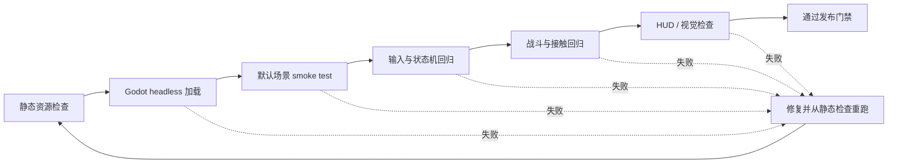

# 测试与验收计划

> 范围：`res://scenes/fray_fighter_demo.tscn` 及其输入、状态机、hitbox、战斗和 HUD 链路。  
> 当前限制：本机 PATH 中没有可用的 `godot` / `godot4`，且当前 checkout 的 `git status --short` 会因权限错误失败；因此自动 headless 和运行时手测需要在提供 Godot 可执行文件路径或可用编辑器环境后执行。

## 1. 测试目标

1. 证明 Fray 输入、状态机和 hitbox 集成符合 Fray-first 规则。
2. 证明 `FrayAttackAttribute` 是攻击和受击反应的唯一数据源。
3. 证明逻辑帧、取消窗口、hitstop buffer clock 和动画表现互不冲突。
4. 证明 melee / projectile 只在成功结算后消费接触。
5. 为新增招式、状态和训练场功能提供可重复的回归基线。

## 2. 测试门禁



## 3. 环境与执行方式

### 自动 / 命令行

在有 Godot 可执行文件的环境中：

```bash
godot --headless --path . --quit
```

若命令为 `godot4`，替换可执行文件名。当前机器不应重复尝试 PATH 中不存在的命令。

### 手动

在 Godot 编辑器中运行：

```text
res://scenes/fray_fighter_demo.tscn
```

建议开启可观察状态标签、碰撞形状或调试输出的开发构建，但不得通过调试代码改变 gameplay 时序。

## 4. 静态检查

| ID | 检查项 | 通过标准 |
|---|---|---|
| ST-01 | UTF-8 无 BOM | `.gd/.tres/.tscn/.godot/.cfg/.md` 无 BOM |
| ST-02 | Godot resource 首字节 | 每个 `.tres/.tscn` 第一个字节为 `[` |
| ST-03 | `res://` 引用 | 引用目标存在 |
| ST-04 | 攻击时序 | startup + active 不大于 duration |
| ST-05 | 取消窗口 | start/end 合法且不越过 duration |
| ST-06 | 攻击数据唯一来源 | fighter/HUD/move 不重复维护 damage/stun/knockback |
| ST-07 | melee provider | move attribute 与 strike hitbox attribute 指向同一 attack resource |
| ST-08 | projectile provider | 使用 `DemoProjectileAttackAttribute` 与 runtime Fray hitbox |
| ST-09 | 状态机 | gameplay state 继承 `FrayState`，拓扑集中在 builder |
| ST-10 | 动画解耦 | attack state 不以 `animation_finished` 作为完成条件 |
| ST-11 | 接触信号 | combat boxes 只监听 manager 重发信号，不重复连接 child |
| ST-12 | 文档链接 | `docs/*.md` 相对链接存在，Mermaid fence 成对 |

## 5. 功能测试矩阵

### 输入与移动

| ID | 前置条件 | 步骤 | 预期 |
|---|---|---|---|
| IN-01 | 默认场景 | `A/D` | 角色左右移动，状态在 idle/walk 间切换 |
| IN-02 | 地面 neutral | 按 `S` 后松开 | 进入 crouch，松开回 neutral |
| IN-03 | 地面 neutral | 按 `W` | `jump_start -> jump -> fall -> land` |
| IN-04 | 第一次跳跃中 | 再按 `W` | 进入一次 double_jump；不能无限跳 |
| IN-05 | 跳跃上升中 | 提前松开 `W` | 跳跃高度不被松键截断 |
| IN-06 | 前跳或后跳已离地 | 持续按反方向，再改按正方向 | 水平轨迹保持起跳速度，不被空中方向输入修正或反转 |
| IN-07 | 地面 neutral | 快速双击前 / 后方向 | 分别进入 dash_forward / dash_back |
| IN-08 | 双方交叉换边 | 再输入 forward/back 指令 | 相对方向自动镜像 |
| IN-09 | 双方在舞台中央发生 pushbox 重叠 | 让双方继续相向移动 | 双方各承担约一半分离距离，结算后不持续重叠 |
| IN-10 | 一方位于墙角且双方 pushbox 重叠 | 让另一方继续向墙角移动 | 墙角角色不越过原点边界，剩余分离距离由另一方承担 |
| IN-11 | 将双方设置到完全相同的 X 坐标 | 推进一个物理帧 | 双方按稳定方向分离，不因零方向永久重叠 |

### 招式与 sequence

| ID | 步骤（面向右） | 预期 |
|---|---|---|
| MV-01 | `J` / `K` / `L` | 分别触发地面 Light / Heavy / Special |
| MV-02 | `S + K` / `S + L` | 分别触发 Sweep / Launcher |
| MV-03 | 空中按 `J/K/L` | 分别触发三种 air attack |
| MV-04 | `D -> S -> S + D + J` | Rising Uppercut 稳定触发 |
| MV-05 | 斜下前与 `J` 同帧，或先到斜下前再按 `J` | 两种时序都能识别 Uppercut |
| MV-06 | `S -> S + D -> D + L` | Ground Wave 稳定触发 |
| MV-07 | 保持 `S + D` 再按 `L` | Ground Wave overlap 分支可识别 |
| MV-08 | `A -> D + K` | Shadow Kick 稳定触发 |
| MV-09 | 换边后重复 MV-04~08 | forward/back 镜像正确 |

### 组合与取消

| ID | 步骤 | 预期 |
|---|---|---|
| CO-01 | `J -> K` | Two-Hit Verdict 完成 |
| CO-02 | `J -> J -> K` | Broken Oath 完成 |
| CO-03 | `D + J -> K` | Forward Judgment 完成 |
| CO-04 | neutral 直接输入后续段按钮 | Straight/Knee/Axe 不可独立触发 |
| CO-05 | 各组合允许窗口内输入 Uppercut | immediate cancel 到 Rising Uppercut |
| CO-06 | 各组合允许窗口内输入 Wave | immediate cancel 到 Ground Wave |
| CO-07 | 各组合允许窗口内输入 Shadow Kick | immediate cancel 到 Shadow Kick |
| CO-08 | 取消窗口外输入 | 不发生非法取消 |
| CO-09 | hitstop 内提前完成取消指令 | 暂停结束后仍可在 gameplay window 消费 |
| CO-10 | 普通攻击期间过早输入并等待超时 | buffer 按 gameplay clock 正常老化 |

### 命中、格挡与状态反应

| ID | 场景 | 预期 |
|---|---|---|
| CB-01 | Mid 对站防 / 蹲防 | 两者均 block |
| CB-02 | Low 对站防 / 蹲防 | 站防命中，蹲防 block |
| CB-03 | Overhead 对站防 / 蹲防 | 站防 block，蹲防命中 |
| CB-04 | block damage 把生命降至 0 | 进入 KO，支持 chip KO |
| CB-05 | Launcher 命中地面目标 | 应用 launch、hitstun、juggle start，落地进入 knockdown |
| CB-06 | Rising Uppercut 命中 | hard knockdown，不能 tech roll |
| CB-07 | soft knockdown 过 untechable 后按 `;` | 进入 tech_roll |
| CB-08 | 未到可受身帧或 hard KD 按 `;` | 不进入 tech_roll |
| CB-09 | combo 连续命中 | HUD hit 数与累计伤害更新，伤害按 0.9 衰减且最低 0.3 |
| CB-10 | 空中连段持续命中 | hitstun 衰减且最低 4f，juggle point 累积 |
| CB-11 | 下一击超过 juggle limit | `receive_hit()` 返回 false，不结算伤害 |
| CB-12 | knockdown/recovery/KO 目标被接触 | 接触被拒绝 |
| CB-13 | 空中攻击接地 | immediate 进入 `land`，不直接 idle |
| CB-14 | 改变攻击动画长度后重复攻击 | active/cancel/duration 逻辑帧不变化 |

### Melee / projectile 接触

| ID | 场景 | 预期 |
|---|---|---|
| CT-01 | melee active 前已与 hurtbox overlap | active 开启时即时 overlap 查询仍能结算 |
| CT-02 | 同一 active window 持续 overlap | 同一目标只成功结算一次 |
| CT-03 | manager 重发一次接触 | 不因 child signal 重复连接而双结算 |
| CT-04 | melee 接触被无敌或 juggle 拒绝 | 不缓存 target，后续 tick 可重试 |
| CT-05 | projectile 成功命中 | 只结算一次并销毁 projectile |
| CT-06 | projectile 接触被拒绝 | projectile 不提前销毁，后续可重试 |
| CT-07 | projectile 超过 lifetime / 边界 | 正常清理，不残留 runtime hitbox |

### HUD 与场景

| ID | 步骤 | 预期 |
|---|---|---|
| UI-01 | 启动场景 | 玩家蓝色、dummy 红色，HUD 显示双方信息 |
| UI-02 | 按 `M` | 招式表打开；再次按下关闭 |
| UI-03 | 检查招式表 | 内容来自默认 loadout，组合名与指令一致 |
| UI-04 | 攻击 / 格挡 / 连段 | 血量、状态、combo 信息同步更新 |
| UI-05 | 按 `R` | 当前场景重载，生命和位置复位 |
| UI-06 | 默认场景静置 | CPU 不移动、不自动格挡、不主动攻击 |

## 6. 需求追踪

| 设计要求 | 主要测试 |
|---|---|
| Fray-first 输入 | IN-01~07、MV-01~09 |
| Fray 状态机表达角色流程 | IN-01~06、CB-05~08、CB-13 |
| Attack attribute 单一来源 | ST-04~08、CB-14 |
| 确定性 gameplay frame | CO-09~10、CB-13~14 |
| 成功后消费接触 | CT-02~06 |
| 朝向语义镜像 | IN-07、MV-09 |
| HUD 不复制 move 数据 | ST-06、UI-02~04 |

## 7. 缺陷记录模板

```text
标题：<系统> <可观察问题>
构建 / 日期：
场景：res://scenes/fray_fighter_demo.tscn
前置状态：
输入步骤（逐帧或按顺序）：
实际结果：
预期结果：
复现率：
相关 move / attack resource：
当前 Fray state / tag：
截图、视频或日志：
```

输入与取消缺陷必须尽量记录双方朝向、当前 gameplay frame、是否处于 hitstop，以及输入是同帧组合还是分步序列。

## 8. 发布 / 合并门禁

- [ ] 静态检查 ST-01~12 通过。
- [ ] 在可用环境中 headless load 成功。
- [ ] 与改动相关的功能矩阵用例通过。
- [ ] 输入、状态机、hitbox、动画改动至少完成一轮完整 smoke test。
- [ ] 文档、招式表和实际资源一致。
- [ ] 未把计划功能写成现有功能。
- [ ] 若包含 `.uid` / `.import`，在变更说明中说明原因。
- [ ] 视觉变化附截图或视频。