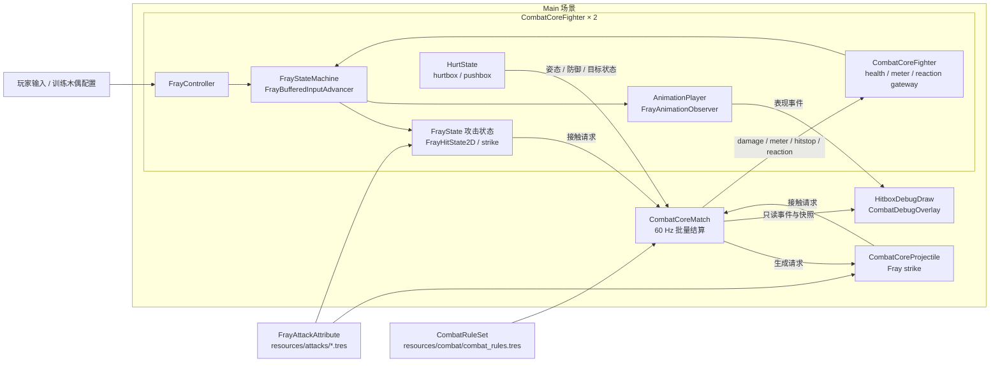
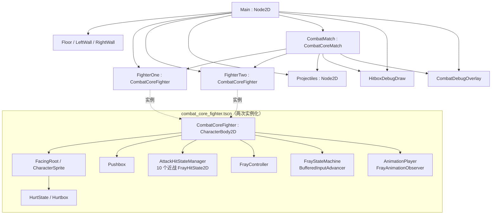
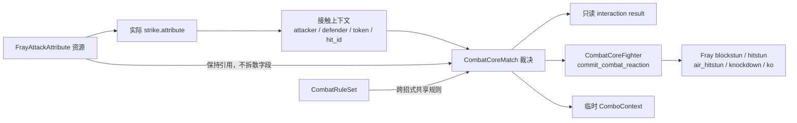

# 02 Fray Combat Core — 软件设计 SDD

- 文档范围：双角色战斗核心、Fray 集成边界、运行时数据流与诊断边界
- 状态：与当前静态实现同步，待 Godot 可执行文件验证
- 版本：v0.1
- 日期：2026-08-08
- 下游：`TDD.md`、`TEST_PLAN.md`

## 1. 设计目标与范围

本项目在 Godot 4.7 中使用 Fray 2.0.0-alpha 建立固定 60 Hz 的双角色战斗闭环。系统设计遵循以下边界：

1. 输入、状态拓扑、命中空间检测和动画观察优先使用 Fray；
2. `FrayAttackAttribute` 是单招攻击与受击反应数据的唯一来源；
3. 项目层仅补充 Fray 未提供的同帧批量结算、连段上下文、统一气条、KO、pushbox、投射物生命周期与诊断；
4. 动画以 34 FPS 表现，攻击判定和战斗规则以 60 Hz 物理帧运行，二者不互相充当时钟；
5. 同一物理帧的接触必须先完整收集，再以稳定顺序提交，避免场景树遍历顺序改变结果。

当前范围不包括实际投技/拆投、精准防御、护甲、clash、通用资源支付技、舞台换场和比赛裁判。

## 2. 系统上下文与模块边界

该图中的箭头表示运行时依赖或只读数据流，不表示所有节点都直接持有彼此。两名 fighter 的具体引用、投射物容器和调试节点由 `main.tscn` 装配。

## 3. 组件职责

| 组件 | 主要职责 | 明确不负责 |
|---|---|---|
| `CombatCoreFighter` | Fray fighter 薄层、生命/气条、攻击 attribute 缓存、接触姿态查询、集中反应网关、hitstop | 不维护第二套攻击定义或自定义状态分发图 |
| `FighterStateMachineBuilder` | 构造 Fray 状态拓扑、tag/rule/condition、输入和资源驱动取消转移 | 不直接结算伤害或命中 |
| `FoundationAttackState` / `CombatCoreProjectileAttackState` | 按 attribute 固定帧推进攻击窗口或施法过程 | 不决定伤害缩放、KO 或最终受击反应 |
| `CombatCoreMatch` | pushbox 分离、接触批次排序/去重、防御与连段裁决、分阶段提交、KO 与快照 | 不拥有单招 damage、硬直、击退等数值 |
| `CombatCoreProjectile` | 投射物 owner、固定方向、移动、实例 token、strike 生命周期 | 不复制投射物攻击参数 |
| `FrayAttackAttribute` | 单招帧数据、伤害、硬直、击退、浮空、取消、防御段位、气条收益和投射物参数 | 不保存跨招式的比赛级规则 |
| `CombatRuleSet` | 生命/气条上限、连段衰减、重复招式缩放、超时和 gameplay FPS | 不保存单招数据 |
| 调试节点 | 消费只读事件、快照和 hitbox 状态并可视化 | 不反向修改战斗真值 |

## 4. 运行时场景装配

场景中只有一个具体 fighter 场景，Player 1 与训练木偶通过同一场景实例和不同运行时配置生成，降低角色运行时结构漂移的风险。

## 5. 战斗数据所有权

约束如下：

- 运行时交互保留 `FrayAttackAttribute` 引用，不把 damage、hitstun、knockback 等拆成重复参数表；
- `ComboContext`、接触 ledger 和 interaction result 都是运行时派生数据，不是第二套招式配置；
- 投射物在 `setup()` 后把最终普通/强化 attribute 直接配置到自身 strike；
- 调试 HUD 只读取快照，不能写回 fighter、attribute 或协调器内部状态。

## 6. 关键质量属性与设计决策

| 质量属性 | 设计决策 | 预期结果 |
|---|---|---|
| 确定性 | 同帧接触完整缓存、稳定排序、token/hit id 去重、分阶段提交 | 支持互击和双 KO，结果不依赖节点遍历顺序 |
| 可维护性 | Fray 状态机集中构建；单招数据集中在 `FrayAttackAttribute` | 新增招式主要通过资源和 Fray 状态扩展完成 |
| 可测试性 | `CombatCoreMatch` 发布 interaction/combo/KO/snapshot 只读事件 | 测试与诊断可观察结果而无需侵入战斗逻辑 |
| 表现解耦 | 34 FPS 动画观察与 60 Hz 判定分离 | 替换动画不会改变 startup/active/recovery 判定 |
| 长稳性 | ledger 600F 回收、投射物命中后关闭 strike 并释放 | 避免训练长跑中的重复命中和无界增长 |
| 双实例安全 | animation tracker `resource_local_to_scene = true` | 两名 fighter 不共享观察器回调状态 |

## 7. 详细设计与验证入口

- 状态机、取消、批量结算时序、反应网关与动画契约：`TDD.md`
- 可执行测试场景、操作步骤和验收矩阵：`TEST_PLAN.md`
- 第 1 组 fighter 底座约束：`../FOUNDATION_BASELINE.md`