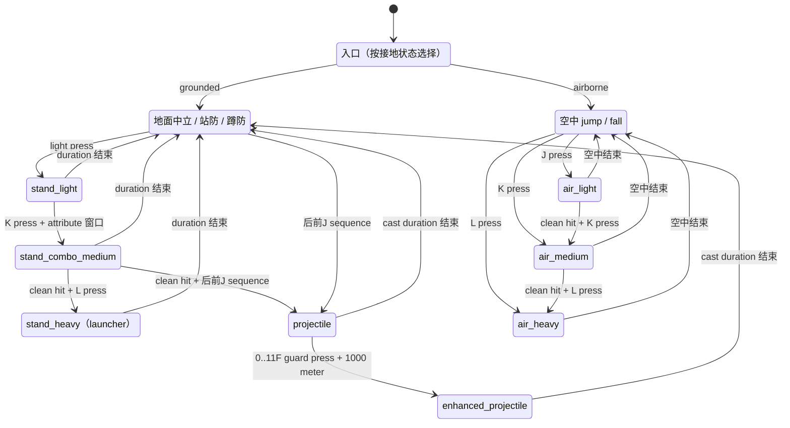
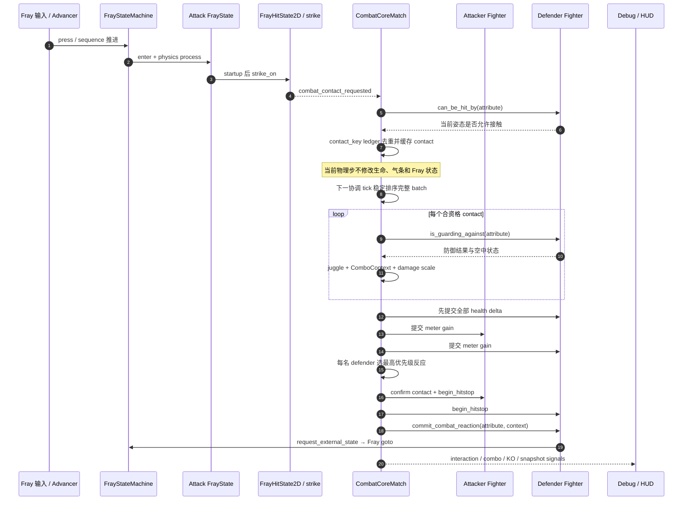
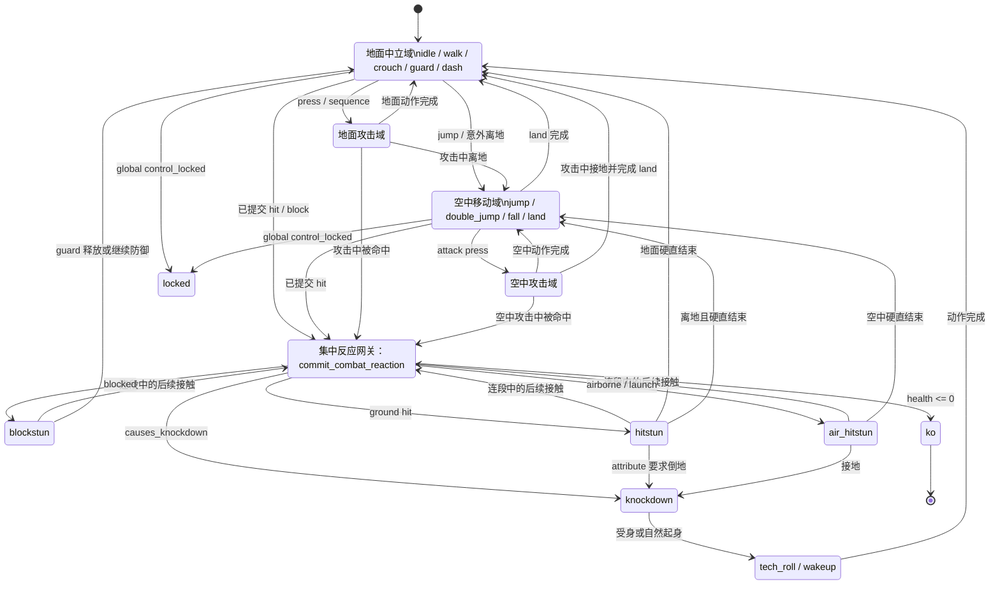

# 02 Fray Combat Core — 实现 TDD

- 文档范围：TDD-HIT、TDD-COMBO、TDD-ANIM
- 状态：已实现静态版本，待 Godot 可执行文件验证
- 版本：v0.3
- 日期：2026-08-08
- 上游：`SDD.md`、`01_战斗系统_SDD模板.docx`、`14_动画音频VFX与打击反馈系统_SDD模板.docx`

## 1. 实现目标

用 Fray hitbox、Fray state machine 和 Fray animation observer 建立双 fighter 最小战斗闭环。所有攻击与受击反应数值必须从接触到的 `FrayAttackAttribute` 读取；项目层只实现 Fray 未提供的批量格斗结算、ComboContext、统一气条、KO 提交和诊断。

## 2. 核心结构

```text
Main
├─ FighterOne / FighterTwo (CombatCoreFighter)
│  ├─ FrayController
│  ├─ FrayStateMachine
│  │  └─ FrayBufferedInputAdvancer
│  ├─ HurtState (FrayHitState2D)
│  ├─ AttackHitStateManager (FrayHitStateManager2D)
│  │  └─ attack states / strike FrayHitbox2D.attribute
│  ├─ AnimationPlayer
│  └─ FrayAnimationObserver
├─ Projectiles
├─ CombatMatch (CombatCoreMatch)
├─ HitboxDebugDraw
└─ CombatDebugOverlay
```

## 3. Fray-First 映射

| 需求 | 实现 |
|---|---|
| 语义输入与缓冲 | `FrayController`、Fray 输入映射、`FrayBufferedInputAdvancer` |
| fighter 流程 | `FrayStateMachine` + `FighterStateMachineBuilder` + `FrayState` 子类 |
| 攻击窗口 | `FoundationAttackState` 按 `FrayAttackAttribute.startup_frames/active_frames/duration_frames` 控制 `FrayHitState2D` |
| 空间接触 | `FrayHitState2D`、`FrayHitbox2D`、hitbox attribute 过滤 |
| 外部受击 | `CombatCoreMatch` 批量提交后集中调用 fighter `request_external_state()` 网关 |
| 动画观察 | `FrayAnimationObserver` + `FrayAnimatorTrackerAnimationPlayer` |
| 项目薄层 | 同帧批次排序/去重、ComboContext、气条、KO、HUD、投射物生命周期 |

## 4. 唯一数据来源

`FrayAttackAttribute` 当前覆盖：

- 帧：duration/startup/active；
- 取消：cancel_start_frame、cancel_end_frame、cancel_requirement、cancel_target_states；
- 命中：damage、block_damage、hitstun、blockstun、hitstop/blockstop；
- 空间反应：knockback、launch、knockdown；
- 防御：guard_type、air block、projectile 标记；
- 投射物：projectile cast/spawn 帧与 projectile_speed；
- 连段：initial scale、juggle start/increment/limit、air hitstun decay；
- 资源：双方在 hit/block 时的 meter gain；
- 表现引用：spark、SFX、screen shake（本最小场景未提供内容资源）。

运行时只传递 attribute 引用与交互上下文，不拆散上述字段。

## 5. 防御段位与接触语义

`FrayAttackAttribute.GuardType` 的项目解析规则如下：

| 类型 | 站防 | 蹲防 | 额外语义 |
|---|---|---|---|
| `HIGH` | 可挡 | 不接触 | 主动蹲姿会直接闪避，且不会提前写入命中 ledger |
| `MID` | 可挡 | 可挡 | 普通中段 |
| `LOW` | 被命中 | 可挡 | 下段 |
| `OVERHEAD` | 可挡 | 被命中 | 越头攻击 |
| `THROW` | 不可挡 | 不可挡 | 仅预留投技段位；当前没有投技招式 |
| `UNBLOCKABLE` | 不可挡 | 不可挡 | 不可防御 |

`CombatCoreMatch` 在建立去重 ledger 前调用 defender 的姿态接触查询，因此 `HIGH` 被蹲姿闪避后不会消耗该攻击实例的后续 active frame 接触机会。

## 6. 数据化取消规则

取消关系由攻击 strike 上的同一 `FrayAttackAttribute` 声明：

- `cancel_start_frame` / `cancel_end_frame`：取消窗口；
- `cancel_requirement`：`ALWAYS`、`ON_HIT`、`ON_BLOCK` 或 `ON_HIT_OR_BLOCK`；
- `cancel_target_states`：合法目标 Fray 状态列表。

`FighterStateMachineBuilder` 读取已由 fighter 校验缓存的 attribute，动态建立 Fray press/sequence transition。当前配置为：

- `stand_light`：窗口内可无条件取消到 `stand_combo_medium`；
- `stand_combo_medium`：仅 clean hit 后可取消到 launcher `stand_heavy` 或普通波 `projectile`；进入普通波后再由状态内 Amplify 窗口决定是否转入 `enhanced_projectile`；
- `air_light` 与 `air_medium`：仅 clean hit 后依次取消到 `air_medium` 与 `air_heavy`，形成空中 `J → K → L`；
- 格挡只记录 `BLOCK`，不会满足 `ON_HIT`；挥空不记录接触，普通波取消 sequence 会在攻击退出时清理。

### 6.1 当前招式与取消路线



图中“attribute 窗口”同时受 `cancel_start_frame`、`cancel_end_frame`、`cancel_requirement` 和 `cancel_target_states` 约束；箭头表示当前资源配置允许的路线，而不是写死在攻击状态类中的招式表。

## 7. 普通波与强化波

- 普通波：相对方向 `后、前、J`，速度 `360`，伤害 `8`；
- 强化波：先完成普通波 `后、前、J`，再于施法第 `0..11F` 按 `;`，支付 `1000` 气（1 格）后转入，速度 `520`，伤害 `12`。

普通波 sequence 仍由 Fray 输入树识别；进入 `projectile` 后，`FrayBufferedInputAdvancer` 在 attribute 声明的窗口内消费 `p1_guard` press transition，并转入共享施法运行时的 `enhanced_projectile`。Amplify 不重播施法动画、不把计时归零，也不延后投射物生成：普通与强化资源都在第 `14F` 生成。支付、窗口和目标分别来自普通波 `FrayAttackAttribute` 的 `amplify_meter_cost`、`amplify_start_frame` / `amplify_end_frame` 与 `amplify_target_state`。两种投射物都把最终施放 resource 传给实例 strike；强化波除 `id`、`projectile_speed`、`damage` 外与普通波保持相同战斗字段，不增加额外硬直、击倒、多段或表现效果。初次进入和重置回合时气条值为 1 格（内部值 `1000`）。

## 8. 固定 Tick 时序

1. Fray 状态/输入推进攻击状态；
2. 攻击状态按 attribute 固定帧切换 strike hitbox；
3. hurtbox 接触回调先检查目标资格，并按 attacker、defender、token 与 hit id 查询/写入 ledger；
4. 合资格且未重复的接触只缓存为 interaction，不直接修改生命和状态；
5. 下一协调 tick 对完整 batch 做稳定排序；
6. 判定防御与 juggle，计算 ComboContext 和缩放；
7. 先提交全部 damage，再提交 meter；
8. 为每名 defender 按“倒地 > 浮空 > 普通命中 > 格挡、同级取较长硬直”选取确定反应，集中进入 blockstun/hitstun/knockdown/KO；
9. 应用双方 hitstop；状态机、输入缓冲年龄、AnimationPlayer 与 Fray observer 同步冻结，并在最后一个物理帧全部节点处理后延迟恢复；
10. 发布只读 interaction、combo、KO 与 CombatSnapshot。

### 8.1 同帧接触批量结算时序



批次内先计算、后分阶段提交，因此 A 与 B 在同一物理帧产生的合法接触都可以进入结果集；生命提交完成后再统一检查 KO，从而保留互击与双 KO 语义。

## 9. 状态与外部跳转

攻击、移动、防御、受击、倒地和 KO 状态仍由 `FighterStateMachineBuilder` 集中构造。战斗协调器不维护 enum/string 状态分发图，只调用 `CombatCoreFighter.commit_combat_reaction()`；该入口再集中映射到现有 Fray `goto()` 网关。攻击中断和回合重置均调用基础 fighter 的 hit state 清理逻辑，保证 strike 关闭。

### 9.1 Fighter 状态域与外部反应网关



图中的“地面中立域”“空中移动域”和攻击域是为提高可读性而合并的状态集合，不是额外 FrayState。`Gateway` 同样是说明性的决策节点，并非额外 FrayState。实际实现由 `CombatCoreFighter.commit_combat_reaction()` 选择反应 kind，再由基础 fighter 的 `request_external_state()` 集中调用 Fray `goto()`。

## 10. 去重策略

```text
contact_key = attacker_id + defender_id + attack_instance_token + hit_id
```

- 近战 token 在每次进入攻击 FrayState 时递增 generation；
- 投射物 token 使用投射物实例 ID，并在生成时缓存固定飞行/击退方向，不受 owner 后续转向影响；
- token 对同一 defender/hit id 至多结算一次；
- ledger 保留 600F 后回收，避免训练长跑无界增长；
- 投射物首次合资格结算后关闭 Fray hit state 并释放；回合重置也先关闭 strike 再排队释放。

## 11. 动画契约

AnimationPlayer 以 34 FPS 提供 idle/attack/guard/turn/hurt/ko 等轻量表现，其中 `turn` 复用下蹲图片序列。Fray observer 记录 started/updated/finished；每个 fighter 的 tracker Resource 使用 `resource_local_to_scene = true`，避免双实例共享 tracker 回调。攻击 hitbox 的 strike_on/off 完全由 60 Hz 固定物理帧和 attribute 决定，因此动画暂停、丢帧或替换不会成为第二套攻击时钟。

## 12. 非目标与限制

本组暂不实现实际投技/拆投、精准防御、护甲、clash、通用资源支付技系统、可视化取消链编辑器、舞台换场和比赛裁判。当前组合提供地面与空中 `J → K → L` 字符串；地面第二段只有 clean hit 后才可取消到 L launcher 或普通波，普通波再通过专用 attribute 驱动的 Amplify 窗口转为强化波。当前强化波支付 1 格气且仅提高速度和伤害。投射物 hitbox、token 和批量结算接口保持可迁移。